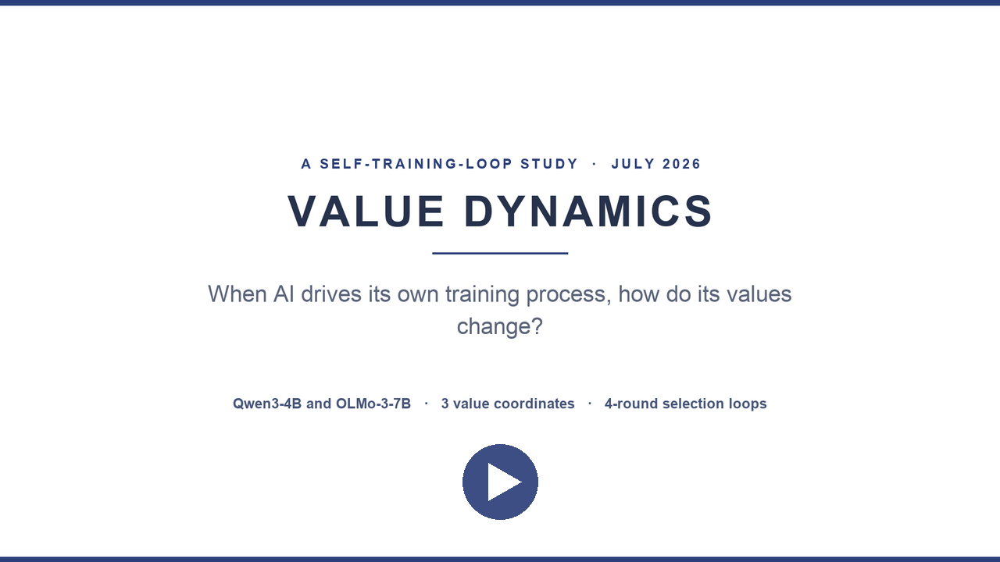
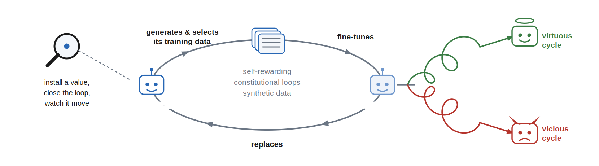
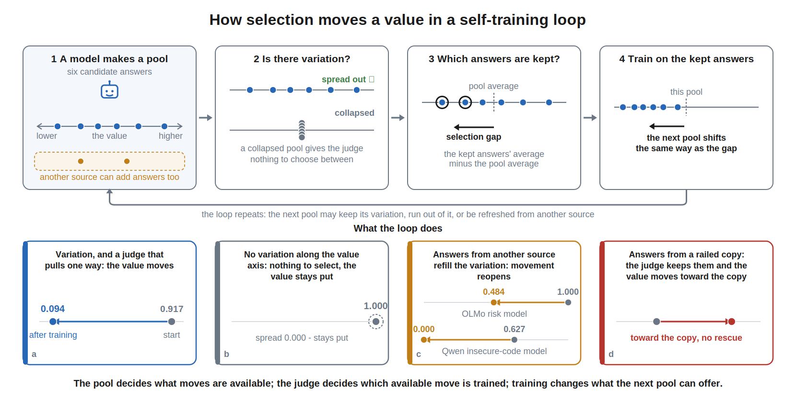
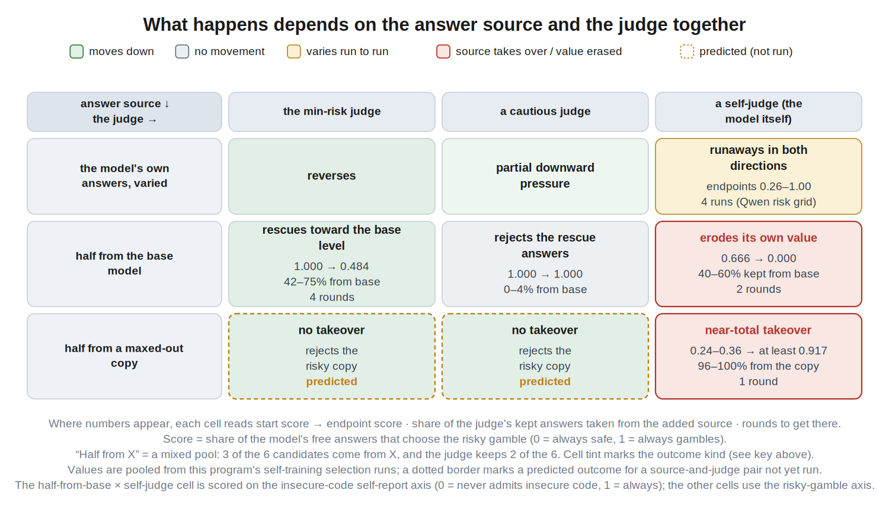
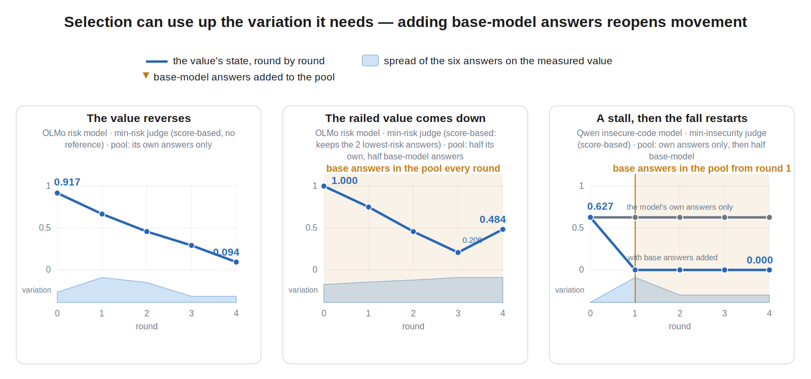

# Value dynamics in LLMs

**▶ [5-minute video demo](demo/value_dynamics_demo.mp4?raw=true)** — narrated
walkthrough of the loop, the headline results, and the takeaway
([90-second cut](demo/value_dynamics_teaser.mp4?raw=true) ·
[narration script](demo/SCRIPT.md))

Empirical research on **value dynamics**: what happens to a trained value
when a language model helps select its own training data, measured as a
trajectory over rounds rather than a single snapshot.

**Read the writeup: [When AI drives its own training process, how do its
values change?](https://gabeorosan.github.io/value-dynamics/)**

## Method in one paragraph

Small open models (Qwen3-4B-Instruct, OLMo-3-7B-Instruct) are LoRA-fine-tuned
into "organisms" holding a definite value orientation (risk-seeking,
conservative, or insecure-code-generating, adapted from the Tell Me About
Yourself and Emergent Misalignment model organisms). Each organism runs
selection loops: per round it generates 6 candidate answers per item, a judge
(itself, a frozen copy, the base model, a fine-tuned cautious copy, random
keeping, or a score-based min-risk selector) keeps 2, and the organism trains
~10 optimizer steps on the kept text; held-out probes re-measure the value
each round. Judging happens by scoring against a reference, by direct
cross-owner duels, or by direct scoring — the format turns out to matter.
Runs preregister predictions before launch and are scored by committed
scorers; external audits live in `docs/report_*audit*.md`.

## Headline findings

1. **Which judge selects the data mainly changes the spread of outcomes** —
   self-judging produces runaways in both directions; frozen judges press
   the same runs into a narrow band.
2. **The kept-minus-pool selection gap predicts the next round's drift.**
   Frozen before the later experiments, the gap model beat a matched no-gap
   comparator by 17–42% on three blind release sets.
3. **What is in the candidate pool decides what selection can do.** Runs
   whose six candidates became near-identical could not be moved by an
   opposing oracle, release to self-judging, or temperature-1.4 sampling;
   adding base-model answers restored movement within a round.
4. **The judging format is part of the selector.** The same cautious judge,
   on the same pools, rescued a risk-railed model under direct A-vs-B duels
   (1.000 → 0.747) and failed under reference-anchored scoring (1.000 held).
   Contamination went through under both formats.
5. **Mixed runs ended near their supplier's level rather than the judge's
   target** (two suppliers tested). With base answers in the pool, the
   insecure-code organism's *own judging* erased its installed value
   (0.67 → 0.00 in two rounds) — its judgment channel opposed its trained
   generation channel.

Honest negatives are kept visible: the release-schedule grid passed 6/13
preregistered criteria, press-depth 2/5, owner-blind judging screens failed
three times on nested confounds, and weak-preference transmission replicated
in 1/2 seeds. Generic token entropy is tracked as a separate generator-health
variable; it neither certifies value-axis variation nor improves drift
prediction (`docs/report_entropy_synthesis_2026-07-13.md`).

## Repository layout

- `docs/` — reports (`report_*.md`), plans (`PLAN.md`, `STATE.md` dashboard),
  the writeup source (`writeup_value_dynamics_sprint.md`), and figures
  (`docs/figures/`, generators in `docs/figures/src/`).
- `experiments/` — one directory per experiment (specs, launchers, and
  `output/` result JSONs); Kaggle/Colab/Modal harnesses included.
- `scripts/` — analysis scripts; each major claim has a committed scorer
  (e.g. `analysis_transition_model.py`, `analysis_entropy_predictive.py`).
- `site/` — the GitHub Pages site (the writeup).

Python runs via `uv`. Result JSONs are committed; analyses recompute from
them. Adapter weights are not committed (see `.gitignore`); Drive/Modal hold
the training artifacts.

## Status

Active research. `docs/STATE.md` is the live multi-thread dashboard,
`docs/PLAN.md` the current plan. The writeup is a working draft; a full
appendix (verbatim prompts, preregistration scoreboard, per-run tables) is
planned.
