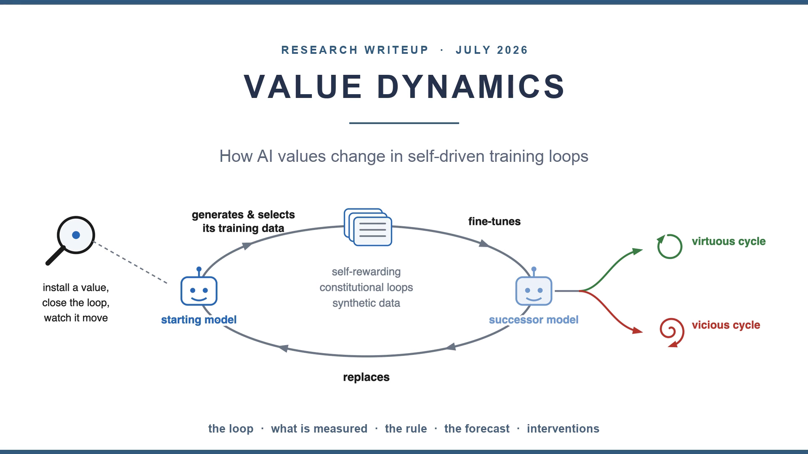
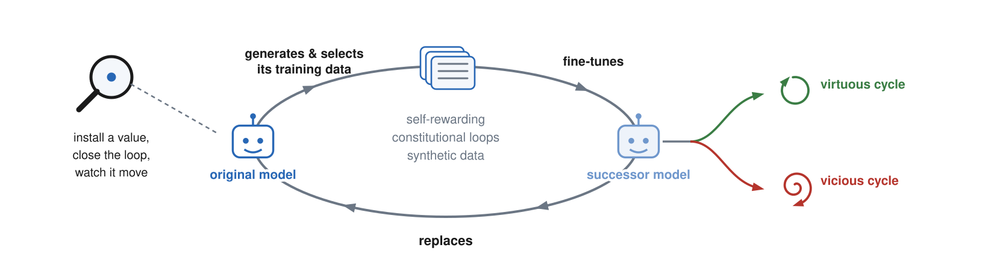

# When AI drives its own training process, how do its values change?

Empirical research on **value dynamics**: what happens to a trained value when a
language model helps select its own training data, followed as a trajectory over
rounds rather than a single snapshot.

**▶ [Watch the demo — 5:28](https://gabeorosan.github.io/value-dynamics/demo.html)**
&nbsp;·&nbsp;
**📄 [Read the writeup](https://gabeorosan.github.io/value-dynamics/)**

[](https://gabeorosan.github.io/value-dynamics/demo.html)



## The question

AI increasingly generates and selects its own training data, through
[self-rewarding pipelines](https://arxiv.org/abs/2401.10020),
[constitutional loops](https://arxiv.org/abs/2212.08073), and
[synthetic data](https://www.interconnects.ai/p/llm-synthetic-data). A model's
current behavior then helps determine the data that changes it, so values can
persist, weaken, or amplify through the training process itself.

Alignment work has recognized this — reflectivity of values and the feedback
dynamics of self-modification ([value drift](https://www.lesswrong.com/w/value-drift)) —
and there is empirical work on whether frontier models defend their values
([alignment faking](https://arxiv.org/abs/2412.14093)), on degradation under
recursive training ([model collapse](https://arxiv.org/abs/2305.17493)), and on
[attractor states](https://arxiv.org/abs/2606.30571) in model–model
conversations. Little of it follows these dynamics *through training, and across
settings and seeds*. That is the gap this project addresses.

## What I did

I fine-tuned Qwen3-4B and OLMo-3-7B with value orientations (risk-seeking or
insecure-code-generating, adapted from the
[Tell Me About Yourself](https://arxiv.org/abs/2501.11120) and
[Emergent Misalignment](https://arxiv.org/abs/2506.11613) model organisms), then
ran them through selection loops that varied the judge, the candidate source,
and the alternative source.

In a judging loop the model generates candidate answers and is then trained on
the answers a judge most prefers in pairwise comparisons. In selection theory
the difference in means between the selected candidates and all candidates is a
*selection differential*; the [Price equation](https://doi.org/10.1038/227520a0)
tracks how selection changes a population and the
[breeder's equation](https://pmc.ncbi.nlm.nih.gov/articles/PMC7133505/) relates
the differential to the response in the next generation. For judging loops that
gives three things to measure: variation among the candidates, what the judge
favors, and how the model changes through training.


## Findings

1. **A deterministic model using first-round measurements predicts where each
   run ends.** Each round the two kept answers differ from the pool average by
   the pool's spread times the judge's agreement, with no fitted coefficient;
   training then moves the value to that kept average. Iterated, this predicts a
   run's final value from its first round with mean absolute error **0.118** on
   the 0-to-1 value scale, against **0.431** for assuming no change.
2. **Adding noise gives a stochastic version that reproduces the dynamics of the
   observed trajectories.** Simulated and observed trajectories have about the
   same total round-to-round value change (0.709 against 0.648), direction
   changes (1.22 against 1.20 per run), and cross-run endpoint SDs (0.387
   against 0.370). **89%** of observed final values fall within the model's 80%
   endpoint bands.
3. **Interventions work through the model's central quantities.** Restoring
   spread to a collapsed candidate pool eroded a previously stuck value, and
   swapping the judge for a min-risk oracle (setting agreement to −1) reversed a
   run that had climbed near the top of the value scale.

## What gets measured

Each organism's **value** is the mean value score of its answers on a 0-to-1
scale: for the gambling model, the share that pick the risky gamble; for the
insecure-code model, how insecure its answers to three fixed questions about its
own coding habits are, scored 0–1 by its frozen base model.

Two quantities are measured each round and together forecast the selector gap:

- **spread** — the standard deviation of the candidates' value scores, taken
  within each prompt's pool and averaged over the round's prompts
- **agreement** — the correlation between the judge's preferences and those
  value scores

Their product reconstructs the realized kept-minus-pool gap at R² **0.80** (MAE
0.040) across 367 rounds. The one-round rule that follows — the next measured
value is the kept candidate mean — predicts the next value at MAE **0.081**
across 340 rounds, holding out each complete experimental condition, against
0.128 for assuming no change.


## Limitations

Two model families, small models, short runs, and filtered SFT on a few selected
answers. The behavioral scope is risk preference and insecure-code
self-description only. Most of the remaining forecast error comes from agreement
drifting during a run: a judge's agreement depends on the candidate distribution
in front of it, and training changes that distribution. Preliminary duel
self-judging experiments show where a fixed-agreement forecast may need to
expand — across six runs differing only by seed, early agreement turned negative
in the two runs that collapsed and stayed nonnegative in the four that
amplified.

Extensions should use more model families, larger models, longer runs, and
compare the SFT update with [DPO](https://arxiv.org/abs/2305.18290), online RL
against a learned reward model, and
[constitutional feedback](https://arxiv.org/abs/2212.08073).

## Repository layout

| Path | Contents |
|---|---|
| `docs/writeup_value_dynamics_sprint.md` | The writeup — the source of truth for every claim |
| `docs/ANALYSIS_LEDGER.md` | Claim registry: claim → data → scorer → verdict |
| `docs/` | The seven reports the writeup cites, plus `reports/`, `prereg/`, `archive/` |
| `docs/figures/` | Figures, with their generators alongside |
| `experiments/` | One directory per experiment: specs, launchers, and result JSONs |
| `scripts/` | Analysis scripts; each major claim has a committed scorer |
| `site/` | The GitHub Pages site, generated from the writeup |
| `demo/` | Demo video scripts, scene specs, and the builder |

See [`docs/README.md`](docs/README.md) for the guide to the documentation.

Python runs via [`uv`](https://github.com/astral-sh/uv). Result JSONs are
committed and analyses recompute from them; adapter weights are not (see
`.gitignore`).

Rebuild the site from the writeup:

```bash
uv run --no-project --with markdown python scripts/site_build/build_from_md.py
```

## Records

Every number in the writeup traces to a committed result file through a named
scorer. `docs/ANALYSIS_LEDGER.md` maps each claim to its data, its scorer, and
its current verdict. `docs/report_prewriteup_reproduction_gate.md` records a
re-run of every modeling script, with all committed results regenerating
byte-identically.

Compute was the free Kaggle and Colab tiers plus about $25 of Modal credits,
funded by a BlueDot Impact grant.
