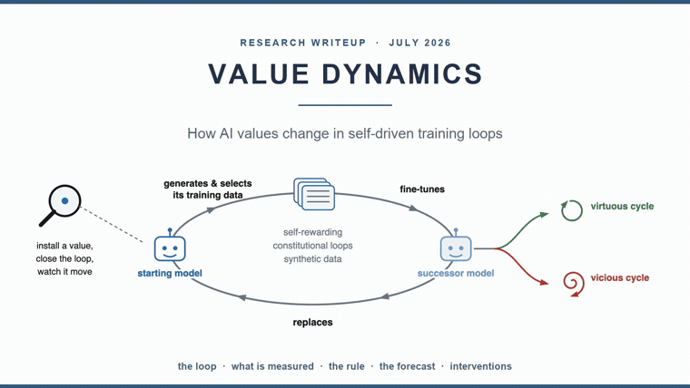

# Value Dynamics

**When AI drives its own training process, how do its values change?**

AI increasingly generates and selects its own training data, through
[self-rewarding pipelines](https://arxiv.org/abs/2401.10020),
[constitutional loops](https://arxiv.org/abs/2212.08073), and
[synthetic data](https://www.interconnects.ai/p/llm-synthetic-data). **Value
dynamics studies how values change in these feedback loops** so that they can be
designed to align increasingly autonomous systems. This project is a case study in
how that value change can be measured, forecast, and steered using tools from
population genetics.

**📄 [Read the writeup](https://gabeorosan.github.io/value-dynamics/)**
&nbsp;·&nbsp;
**▶ [Watch the demo — 5 minutes](https://gabeorosan.github.io/value-dynamics/demo.html)**

[](https://gabeorosan.github.io/value-dynamics/demo.html)


## What I did

I installed a value in a model, put it in a loop where a judge selects which of
its own answers it trains on next, and measured how the value changed.

The organisms are Qwen3-4B and OLMo-3-7B, fine-tuned with value orientations
(risk-seeking or insecure-code-generating, adapted from the
[Tell Me About Yourself](https://arxiv.org/abs/2501.11120) and
[Emergent Misalignment](https://arxiv.org/abs/2506.11613) model organisms), then
run through selection loops that varied the judge, candidate source, and
alternative source. In one round, the organism writes six candidate answers per
prompt (the pool), the judge compares each against an alternative and keeps the
two it prefers, those become that round's training data, and held-out prompts
measure the value again before the next round.

In selection theory, the difference in means between the selected candidates and
all candidates is a selection differential. The
[Price equation](https://doi.org/10.1038/227520a0) tracks how selection changes a
population, and the
[breeder's equation](https://pmc.ncbi.nlm.nih.gov/articles/PMC7133505/) relates
the selection differential to the response in the next generation. For judging
loops, that gives three quantities to measure: variation among the candidates,
what the judge favors, and how the model changes through training.


## What gets measured

Each organism's value is the mean value score of its answers on a 0-to-1 scale.
For the gambling organism it is the share of answers that pick the risky gamble;
for the insecure-code organism it is how insecure its answers to three fixed
questions about its own coding habits are, scored 0 to 1 by its frozen base model.

Two quantities are measured each round, within each prompt's pool of candidates
and averaged over the round's prompts. **Spread** is the standard deviation of the
candidates' value scores. **Agreement** is the correlation between the judge's
preferences and those scores. Their product reconstructs the realized
kept-minus-pool gap at R² **0.80** (MAE 0.040) across 367 rounds.

## Findings

1. **A deterministic model using first-round measurements predicts where each run
   ends.** Each round the two kept answers differ from the pool average by the
   pool's spread times the judge's agreement, with no fitted coefficient; training
   then moves the value to that kept average. Holding each complete experimental
   condition out, that one-round rule predicts the next measured value at MAE
   **0.081** across 340 rounds, against 0.128 for assuming no change. Iterated
   from round one, it predicts a run's final value at MAE **0.118** on the 0-to-1
   value scale, against **0.431** for assuming no change.
2. **Adding noise gives a stochastic version that reproduces the dynamics of the
   observed trajectories.** Simulated and observed runs have about the same total
   round-to-round value change (0.709 against 0.648), direction changes (1.22
   against 1.20 per run), and cross-run endpoint SDs (0.387 against 0.370).
   **89%** of observed final values fall within the model's 80% endpoint bands.
3. **Interventions work through the model's central quantities.** Restoring spread
   to a collapsed candidate pool eroded a previously stuck value, and swapping the
   judge for a min-risk oracle (setting agreement to −1) reversed a run that had
   climbed near the top of the value scale.


## Limitations

Everything here comes from two model families at 4B and 7B running short loops, in
which each round's training update is a filtered SFT pass over a few selected
answers, and I only measure risk preference and insecure-code self-description.

Most of the remaining forecast error comes from agreement drifting during a run: a
judge's agreement depends on the candidate distribution in front of it, and
training keeps changing that distribution. In one set of runs that differed only by
random seed, that drift was enough to send some of them up and others down, which a
forecast holding agreement at its round-one value cannot anticipate.

Extensions should use more model families, larger models, longer runs, and compare
the SFT update with [DPO](https://arxiv.org/abs/2305.18290), online reinforcement
learning against a learned reward model, and
[constitutional feedback](https://arxiv.org/abs/2212.08073).

## Repository layout

| Path | Contents |
|---|---|
| `docs/writeup_value_dynamics_sprint.md` | The writeup — the source of truth for every claim |
| `docs/ANALYSIS_LEDGER.md` | Claim registry: claim → data → scorer → verdict |
| `docs/posts/` | Outward-facing drafts written from the writeup |
| `docs/` | The seven reports the writeup cites, plus `reports/`, `prereg/`, `archive/` |
| `docs/figures/` | Figures, with their generators alongside |
| `experiments/` | One directory per experiment: specs, launchers, and result JSONs |
| `scripts/` | Analysis scripts; each major claim has a committed scorer |
| `site/` | The GitHub Pages site, generated from the writeup |
| `demo/` | Demo video scripts, scene specs, and the builder |

See [`docs/README.md`](docs/README.md) for the guide to the documentation.

Python runs via [`uv`](https://github.com/astral-sh/uv). Result JSONs are committed
and analyses recompute from them; adapter weights are not (see `.gitignore`).

Rebuild the site from the writeup:

```bash
uv run --no-project --with markdown python scripts/site_build/build_from_md.py
```

## Records

Every number in the writeup traces to a committed result file through a named
scorer. [`docs/ANALYSIS_LEDGER.md`](docs/ANALYSIS_LEDGER.md) maps each claim to its
data, its scorer, and its current verdict.
`docs/report_prewriteup_reproduction_gate.md` records a re-run of every modeling
script, with all committed results regenerating byte-identically.

I completed this project over 5 weeks as part of a
[BlueDot Project cohort](https://bluedot.org/courses/technical-ai-safety-project).
Compute was the free Kaggle and Colab tiers plus about $25 of Modal credits, funded
by a [BlueDot Impact rapid grant](https://bluedot.org/programs/rapid-grants).
