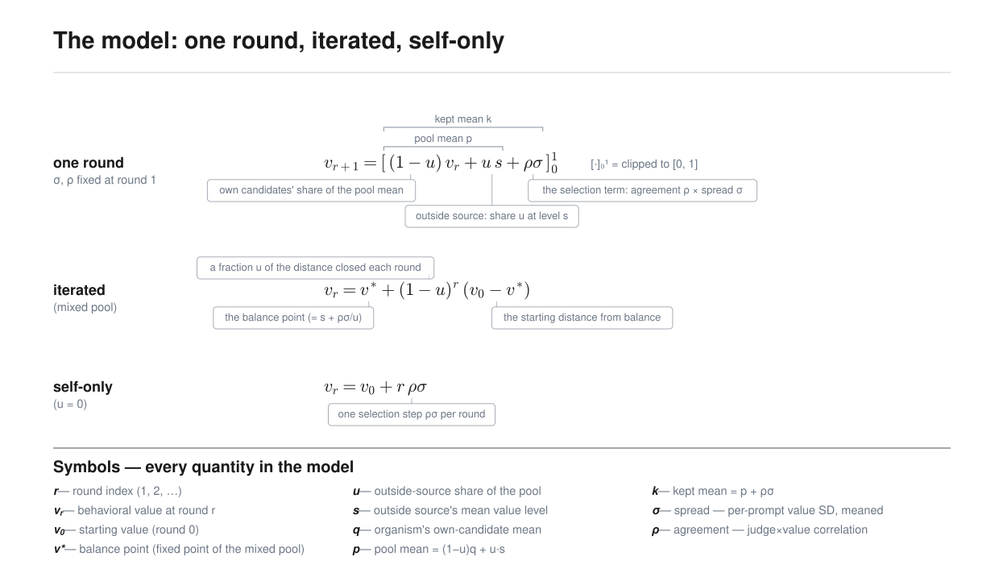

# Round one tells you where a self-training run's values end up

I put a model with an installed value into a loop where a judge picks which of the
model's own answers it trains on next, and measured the value again each round on
held-out prompts. The question was whether anything short of running the loop
tells you where it ends up.

Two numbers measured in round one do. **Spread** is the standard deviation of the
candidates' value scores. **Agreement** is the correlation between the judge's
preferences and those scores. Both are computed within each prompt's pool of six
candidates and averaged over the round's prompts.

The rule is that each round the two kept answers differ from the pool average by
spread times agreement, and training then moves the value to that kept average.
Iterating it from round one, with spread, agreement, and pool composition frozen
at their round-one values, predicts a run's final value with mean absolute error
0.118 on the 0-to-1 value scale, against 0.431 for assuming no change. There is no
fitted coefficient anywhere in that.

## Three ways I expected this to fail

**Training does not have to land on what the judge kept.** A filtered-SFT update
on two answers could move the value anywhere. Holding each complete experimental
condition out, the kept-mean rule predicts the next measured value with MAE 0.081
across 340 rounds, against 0.128 for assuming no change. This is the version of
the claim I trust most, because holding out whole conditions means the rule is
never tested on a condition it was checked against, and the no-change baseline is
strong here: on a single round, most values do not move much.

**The judge's preferences and the value scale could fail to line up.** They line
up well enough to be multiplied: across 367 rounds with logged judge scores,
spread times agreement reconstructs the realized kept-minus-pool differences at
R² 0.80 and MAE 0.040. Using the forecast instead of the observed kept mean costs
a little accuracy on those rounds, MAE 0.100 against 0.085, and buys the ability
to run the model before the judge does.

**Errors could compound over rounds.** They do not, much. Forecast MAE is 0.100
one round out and 0.130 four rounds out, while the no-change baseline degrades
from 0.31 to 0.43. Selection moves a run mostly in its first rounds and then
levels off, so a forecast that gets the early move right stays right at the
endpoint.

## The spread of trajectories, not just the average

A deterministic forecast gives the average path that real runs scatter around, and
for anything safety-relevant the scatter is the point. The value is read from a
limited number of sampled answers, so each reading carries sampling noise, and the
loop varies too: the judge's picks land around spread times agreement rather than
exactly on it, training lands near but not exactly on the kept mean, and agreement
drifts between rounds. Adding a noise term at each of those points, sized from the
measured residuals, gives a stochastic version.

Sampled forward, it reproduces the observed dynamics: total round-to-round value
change 0.709 against 0.648 observed, direction changes 1.22 per run against 1.20,
cross-run endpoint SD 0.387 against 0.370, and 89% of observed final values inside
the predicted 80% bands.

## What this buys, if it holds up

If where a loop ends up is set by two measurable quantities, then those quantities
are where interventions should act. Two experiments test that. Adding base-model
answers to a collapsed pool restores spread, which let the judge's agreement pull
a value that had been stuck. Swapping the base-model judge for a min-risk oracle,
which sets agreement to −1, reversed a run that had climbed near the top of the
value scale. Each is one experiment, so what they support is that spread and
agreement look like usable targets and that the effect of changing them can be
forecast from their new values.

## Where it breaks

Most of the remaining forecast error comes from agreement drifting during a run.
A judge's agreement depends on the candidate distribution in front of it, and
training keeps changing that distribution, so a forecast that holds agreement
fixed at its round-one value will need to expand.

Preliminary duel self-judging experiments show what that costs. Across six runs
differing only by seed, early agreement turned negative in the two runs that
collapsed and stayed nonnegative in the four that amplified. Runs identical except
for a seed went opposite ways, and the sign of early agreement is what separated
them.

The setup is also narrow: two model families, small models, short runs,
filtered SFT on a few selected answers, and a behavioral scope of risk preference
and insecure-code self-description. Extensions should use more model families,
larger models, longer runs, and compare the SFT update with
[DPO](https://arxiv.org/abs/2305.18290), online reinforcement learning against a
learned reward model, and
[constitutional feedback](https://arxiv.org/abs/2212.08073), with more open-ended
setups where models select their own data, revise system prompts, and edit the
loop itself.

I completed this project over five weeks for BlueDot Impact's [Technical AI Safety
Project Sprint](https://bluedot.org/courses/technical-ai-safety-project).

- Code and result JSONs: https://github.com/gabeorosan/value-dynamics
- Full writeup: https://gabeorosan.github.io/value-dynamics/
