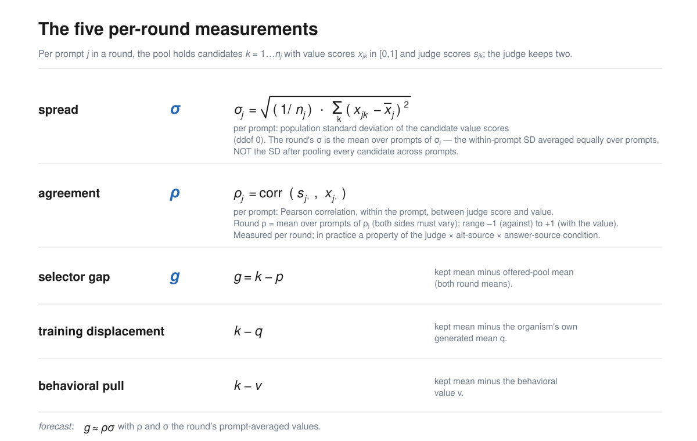

# Value dynamics: studying AI values in the loops that train them

**Epistemic status.** The framing here is a research agenda I want other people to
work on. The evidence for it is one five-week project I completed for BlueDot Impact's [Technical AI Safety Project Sprint](https://bluedot.org/courses/technical-ai-safety-project), on two model families and two
installed values, so treat it as an existence proof that these quantities are
measurable and forecastable, not as settled numbers.

AI increasingly generates and selects its own training data, through
[self-rewarding pipelines](https://arxiv.org/abs/2401.10020),
[constitutional loops](https://arxiv.org/abs/2212.08073), and
[synthetic data](https://www.interconnects.ai/p/llm-synthetic-data). Value
dynamics studies how values change in these feedback loops so that they can be
designed to align increasingly autonomous systems.

Alignment work has recognized the importance of reflectivity of values and the
feedback dynamics of self-modification
([value drift](https://www.lesswrong.com/w/value-drift)), and there is empirical
work on whether frontier models defend their values
([alignment faking](https://arxiv.org/abs/2412.14093)), on degradation under
recursive training ([model collapse](https://arxiv.org/abs/2305.17493)), and on
[attractor states](https://arxiv.org/abs/2606.30571) that emerge in model–model
conversations. Little of it follows these dynamics through training and across
settings and seeds. That is the gap, and following a value through training is a
different kind of measurement from evaluating a checkpoint: what you want is a
trajectory, its direction, and how widely it scatters across seeds.

## What selection theory offers

The loop I studied is a judging loop: a model generates candidate answers, then is
trained on the answers most preferred by a judge in pairwise comparisons against
alternatives. That is selection on a population the model itself produced.

In selection theory, the difference in means between the selected candidates and
all candidates is a selection differential. The
[Price equation](https://doi.org/10.1038/227520a0) tracks how selection changes a
population, and the
[breeder's equation](https://pmc.ncbi.nlm.nih.gov/articles/PMC7133505/) relates
the selection differential to the response in the next generation. Borrowing that
decomposition tells you what to measure in a judging loop instead of guessing:
variation among the candidates, what the judge favors, and how the model changes
through training.

Concretely, two quantities per round. **Spread** is the standard deviation of the
candidates' value scores. **Agreement** is the correlation between the judge's
preferences and those scores. Both are computed within each prompt's candidate
pool and averaged over the round's prompts.

## The sprint result: these quantities carry the run

The reason to take the framing seriously is that the two quantities predict rather
than merely describe. Each round, the kept answers differ from the pool average by
spread times agreement, and training moves the value to that kept average, with no
fitted coefficient in either step. Holding each complete experimental condition
out, that one-round rule predicts the next measured value with MAE 0.081 across
340 rounds, against 0.128 for assuming no change. Across 367 rounds with logged
judge scores, spread times agreement reconstructs the realized differentials at R²
0.80.

Iterated from round-one measurements, with spread, agreement, and pool composition
frozen, it predicts a run's final value with MAE 0.118 on the 0-to-1 value scale,
against 0.431 for assuming no change. Adding noise terms sized from the measured
residuals gives a stochastic version whose simulated runs accumulate about as much
round-to-round change as the real ones (0.709 against 0.648), change direction
about as often (1.22 against 1.20 per run), and scatter about as widely at the end
(endpoint SD 0.387 against 0.370), with 89% of observed final values inside the
predicted 80% bands.

## Why designing loops is the point

If a loop's destination is set by measurable quantities, those quantities are
where design decisions and interventions act. Two experiments test that directly.
Adding base-model answers to a collapsed pool restores spread, which let the
judge's agreement pull a value that had been stuck. Swapping the base-model judge
for a min-risk oracle, which sets agreement to −1, reversed a run that had climbed
near the top of the value scale. Each is a single experiment, and what they
support is that spread and agreement look like usable intervention targets whose
effect can be forecast from their new values.

Natural and cultural selection sculpted human values. Value dynamics research can
help identify artificial selection mechanisms that can be engineered into virtuous
cycles for aligning increasingly autonomous AI systems.

## What the agenda needs next

**Other update rules.** My loop uses filtered SFT on a few selected answers. The
same decomposition should be checked against [DPO](https://arxiv.org/abs/2305.18290),
online reinforcement learning against a learned reward model, and
[constitutional feedback](https://arxiv.org/abs/2212.08073), where the response to
selection has a different shape.

**Other behaviors.** My scope is risk preference and insecure-code
self-description. The interesting cases are moral judgment,
[AI identity](https://arxiv.org/abs/2603.11353), and
[emergent misalignment](https://arxiv.org/abs/2502.17424), with evaluations for
other behaviors and for internal representations rather than behavior alone.

**Loops that drift.** Most of my remaining forecast error comes from agreement
drifting during a run: a judge's agreement depends on the candidate distribution
in front of it, and training keeps changing that distribution. Preliminary duel
self-judging experiments show what a fixed-agreement forecast misses. Across six
runs differing only by seed, early agreement turned negative in the two runs that
collapsed and stayed nonnegative in the four that amplified. A model of when
agreement flips sign would be worth more than a better fit at fixed agreement.

**Open-ended setups.** Give models more freedom in selecting training data,
revising system prompts, and editing the loop itself. Repeated games and agentic
environments could reveal whether their dynamics favor
[cooperation](https://doi.org/10.1126/science.7466396) or defection,
[resource grabbing](https://arxiv.org/abs/1912.01683), and
[reward hacking](https://arxiv.org/abs/1908.04734).

**Scale.** Two model families at 4B and 7B with short runs is where the
numbers above come from. Whether the same two quantities carry a frontier-scale
loop over many rounds is exactly the thing I cannot tell you.

- Code and result JSONs: https://github.com/gabeorosan/value-dynamics
- Full writeup: https://gabeorosan.github.io/value-dynamics/
