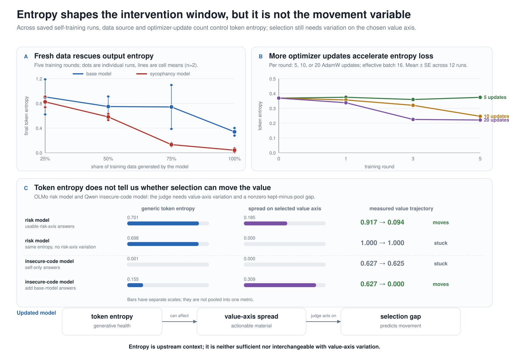

# Entropy in the value-dynamics model

**Answer:** the component analyses existed, but the analysis needed for the main
model had not been completed. The repository separately showed an entropy effect
of training-data source, a mixing-ratio gradient, and an update-dose gradient. It
did not put those results beside the later candidate-pool results, and therefore
did not answer whether generic token entropy is the same thing as the
"variation" required for value movement.

It is not. The saved artifacts and the transition-model ablation support the
following model:

1. **Generic token entropy is a controllable generative-health outcome.** It is
   affected by how much fresh data enters the loop, how large each update is,
   and the current organism/loop.
2. **Entropy is not a useful signed transition predictor here.** It does not
   improve seed-held-out next-round drift prediction consistently, either alone
   or added to the kept-minus-pool gap.
3. **Generic entropy is not a general leading indicator of later candidate
   supply.** A post-first-update signal appears inside K2, but it reverses sign
   and becomes negligible in the longer release trajectories. Nine release
   trajectories exhaust target-axis spread without generic entropy collapse.
4. **Value-axis spread is the actionable supply variable.** It measures whether
   the candidate pool contains meaningfully different options on the coordinate
   the judge is selecting.
5. **The realized selection gap is the immediate movement variable.** Ordinary
   token entropy neither certifies value-axis spread nor substitutes for the
   kept-minus-pool gap.

## Why entropy disappeared from the main figures

The old entropy figure was correctly archived as out of date. It presented the
fresh-data mixing result, then claimed that a fresh-candidate selection loop
"never collapses" and that collapse requires verbatim re-ingestion. The later
insecure-code self-aware loop falsified that generalization: all eight cells
collapsed from baseline entropy 0.56/0.81 to 0.004–0.035 after two rounds,
despite generating a fresh candidate pool each round.

The replacement figure set moved to the stronger intervention-window result —
variation on the selected value axis — but did not explicitly explain how that
quantity relates to generic token entropy. That omission made entropy look as if
it had been discarded when it should instead have been shown as a separate
generator-health readout and explicitly tested against later candidate supply.

## Reconstructed analysis

All numbers below were recomputed from the saved JSON artifacts by
[`scripts/analysis_entropy_synthesis.py`](../scripts/analysis_entropy_synthesis.py).
The machine-readable result includes file paths and SHA-256 hashes:
[`experiments/entropy_synthesis_analysis.json`](../experiments/entropy_synthesis_analysis.json).

### 1. Training-data source controls token entropy

The 20-rollout SFT anatomy run compared self-generated text with several sources
of external text. After five rounds, self-generated training was the only source
that lowered mean open-generation token entropy:

| training source | base model final entropy | sycophancy model final entropy | runs per cell |
|---|---:|---:|---:|
| self-generated answers | 0.374 | 0.084 | 2 |
| random external packet | 1.132 | 1.493 | 2 |
| neutral external QA | 1.428 | 1.285 | 2 |
| off-domain external tradeoffs | 1.598 | 1.503 | 2 |

The self-generated endpoints replicated in the separate mixing run to within
0.035 for the base model and 0.042 for the sycophancy model.

Source: [`sft_drift_anatomy.json`](../experiments/kaggle/kaggle_sft_drift_anatomy/output/sft_drift_anatomy.json).

### 2. Fresh-data fraction produces a monotone mean rescue curve

After five rounds, mean entropy increased monotonically as the self-generated
share fell in both organisms:

| self-generated share | base model | sycophancy model | runs per cell |
|---:|---:|---:|---:|
| 100% | 0.340 | 0.042 | 2 |
| 75% | 0.742 | 0.132 | 2 |
| 50% | 0.749 | 0.581 | 2 |
| 25% | 0.905 | 0.824 | 2 |

This is strong directional evidence but not a precise threshold estimate. Each
cell has only two runs, and the base-model 75% cell is visibly bistable: its two
endpoints were 0.387 and 1.097.

Source: [`selfgen_collapse_mixing.json`](../experiments/kaggle/kaggle_selfgen_collapse_mixing/output/selfgen_collapse_mixing.json).

### 3. Update dose produces a powered entropy gradient

The 36-rollout basin ensemble provides the best-powered entropy result. The
primary value coordinate was saturated and could not answer the intended basin
question, but the entropy measurement remained informative:

| optimizer steps per round | round 1 | round 3 | round 5 | runs per dose |
|---:|---:|---:|---:|---:|
| 5 | 0.374 | 0.359 | 0.374 | 12 |
| 10 | 0.356 | 0.320 | 0.246 | 12 |
| 20 | 0.338 | 0.225 | 0.221 | 12 |

At round 5, the 5-step run had higher entropy than its matched 10-step run in
12/12 seeds (one-sided exact sign test, *p*=0.000244), and higher entropy than
the matched 20-step run in 12/12 seeds (*p*=0.000244). The 10-step value exceeded
the 20-step value in 9/12 seeds (*p*=0.073). These are reconstructed, uncorrected
diagnostic tests; the means and paired directions matter more than a thresholded
significance label.

Source directory: [`basin_ensemble`](../experiments/modal/modal_measurement_service/output/basin_ensemble).

### 4. There is no universal "self-data causes entropy collapse" rule

The effect depends on both the organism and the loop:

- In the fresh-candidate risk loop, entropy did not collapse. Across eight seeds,
  the self condition rose from 0.388 to 0.417 and the cross condition stayed
  approximately flat, 0.388 to 0.391.
- In the fresh-candidate insecure-code loop, all eight cells collapsed to below
  0.04 after two rounds. The low-dose cells fell from 0.559 to 0.019–0.035; the
  high-dose cells fell from 0.812 to 0.004–0.012.

Therefore, fresh candidate sampling is not sufficient protection. "Verbatim
re-ingestion versus fresh sampling" was an early empirical contrast, not the
general mechanism.

Sources: [`basin_anchor.json`](../experiments/kaggle/kaggle_basin_anchor/output/basin_anchor.json)
and [`selfaware_loop_grid.json`](../experiments/em_selfaware_loop/output/selfaware_loop_grid.json).

### 5. Generic entropy is not actionable value-axis variation

The cleanest separation comes from two OLMo risk-model trajectories:

| case | generic token entropy across checkpoints | target risk-axis pool spread | risk trajectory |
|---|---:|---:|---:|
| pool contains lower-risk material | 0.619–0.751 | 0.073–0.303 | 0.917→0.094 |
| pool is homogeneous on risk | 0.650–0.754 | 0.000 every round | 1.000→1.000 |

The generic-entropy intervals overlap almost completely. The immobile rail is not
generically deterministic; it is specifically homogeneous on the risk coordinate.
That is why generic token entropy cannot replace within-pool target-axis spread in
the intervention-window model.

The matched Qwen insecure-code pair shows the reopening intervention from the
opposite side:

| candidate supply | first post-update token entropy | round-1 insecurity-axis spread | self-report trajectory |
|---|---:|---:|---:|
| self-only | approximately 0.001 | 0.000 | 0.627→0.625 |
| add three base-model answers | 0.141–0.169 | 0.304–0.313 | 0.627→0.000 in 2/2 runs |

This pair shows that outside supply reopens the loop, but it restores both generic
diversity and target-axis spread at once. It therefore does **not** identify which
quantity is independently causal. The OLMo comparison supplies the missing
specificity: ordinary entropy can be present without target-axis material or
movement.

Sources: [`k2rel_oracle_hold_s21.json`](../experiments/modal_k2_release/output/k2rel_oracle_hold_s21.json),
[`k2rel_oracle_hold_s22.json`](../experiments/modal_k2_release/output/k2rel_oracle_hold_s22.json),
[`mixed_reopen_qwen.json`](../experiments/em_selfaware_loop/output/mixed_reopen_qwen.json),
and [`mixed_reopen_twin_selfonly.json`](../experiments/em_selfaware_loop/output/mixed_reopen_twin_selfonly.json).

### 6. Entropy does not improve the signed transition predictor

The earlier analysis did not test entropy in the predictive model even though
checkpoint entropy is available for every transition in the canonical K1/K2/K3
grids. I added a post-hoc grouped-CV ablation using the same transition unit and
the stricter leave-one-seed-out grouping. `C` is a condition-intercept model,
`H` adds checkpoint entropy, `G` adds the realized kept-minus-pool gap, and `GH`
adds both. RMSE is next-round signed drift error; lower is better.

| grid | transitions | C | H | G | GH | entropy added to G |
|---|---:|---:|---:|---:|---:|---:|
| Qwen risk | 48 | 0.126 | 0.134 | **0.095** | 0.091 | −3.4% |
| OLMo risk | 51 | 0.091 | 0.094 | **0.074** | 0.076 | +3.4% |
| Qwen insecure-code/candor | 36 | 0.064 | 0.065 | **0.050** | 0.050 | −0.6% |

Entropy alone is worse than condition intercepts in all three grids. Adding it
to the gap gives a small improvement in Qwen risk, a similarly sized degradation
in OLMo risk, and essentially no change in the insecure-code grid. The apparent
Qwen-risk gain occurs in only 2/4 seed folds, so it is not a stable exception.

The later OLMo release runs provide a larger temporal check. Models fit on the
original K2 grid were applied without refitting to 140 later transitions:

| K2-trained model | later-transition RMSE |
|---|---:|
| condition only | 0.0856 |
| condition + entropy | 0.0844 |
| condition + gap | **0.0558** |
| condition + gap + entropy | 0.0576 |

Entropy also fails as a consistent predictor of movement magnitude. It modestly
improves an absolute-gap model only in K3 (3/3 seed folds), whose entropy prompts
are themselves insecurity-related rather than generic, and does not transport to
the later OLMo data. The one-round value-axis-spread result is also inconsistent:
entropy helps slightly in K2, hurts in K1/K3, and hurts when the K2 fit is applied
without refitting to the 140-transition temporal holdout.

So the predictive result is a real negative result, not an omission to hide:
generic entropy is important for diagnosing self-consuming collapse and for
comparing data-source/update interventions, but it does not tell us the direction
of the next value update. The signed gap does.

Reproduce with
[`scripts/analysis_entropy_predictive.py`](../scripts/analysis_entropy_predictive.py);
saved output:
[`experiments/entropy_predictive_analysis.json`](../experiments/entropy_predictive_analysis.json).

### 7. The longer-horizon candidate-supply hypothesis is local, not general

The immediate-transition ablation was not enough to test the proposed upstream
mechanism. I therefore added a separate post-hoc analysis asking whether entropy
after an early update forecasts target-axis candidate spread one to three rounds
later, after conditioning on the current spread and condition. Validation holds
out complete seeds; the 20 release trajectories are also evaluated by
leave-one-trajectory-out prediction.

There is a real exploratory signal inside the canonical OLMo K2 grid. From the
post-first-update state to the terminal pool two rounds later, adding current
entropy lowers held-out RMSE from 0.0953 to 0.0833 (−12.6%; better in 5/6 seed
folds). Using entropy loss from baseline lowers it further to 0.0751 (−21.2%;
5/6 folds). The same entropy-loss feature lowers error for mean future spread by
24.6% and minimum future spread by 26.3%. Its fitted direction is intuitive:
higher post-update entropy predicts more later target-axis spread.

That association does not generalize:

| evaluation | horizon | current spread only | + current entropy | change | held-out groups improved |
|---|---:|---:|---:|---:|---:|
| later OLMo release, refit within release | 1 round | 0.0817 | 0.0812 | −0.6% | 14/20 |
| later OLMo release, refit within release | 2 rounds | 0.1096 | 0.1085 | −1.0% | 14/20 |
| later OLMo release, refit within release | 3 rounds | 0.1306 | 0.1302 | −0.3% | 10/20 |

The tiny release association has the **opposite sign**: higher generic entropy
predicts slightly *less* later risk-axis spread at all three horizons, and every
leave-one-trajectory-out coefficient has that sign. More decisively, when the K2
entropy-loss model is transported to post-update release states without refitting,
it worsens error by 9.5% at one round and 23.4% at two rounds. Generic entropy also
never crosses the post-hoc 25%-of-baseline collapse threshold in the release
trajectories, while target-axis spread is exhausted in 9/20 of them.

K1 supplies no corresponding early-to-terminal gain. K3 shows entropy collapse
at or before spread exhaustion in all nine trajectories where both occur, but its
"entropy" prompts directly concern insecurity and are therefore partially
axis-aligned; this cannot identify a generic entropy-to-supply mechanism. The
three-round K1/K3 regressions are also too sparse or unstable to interpret; rank
and conditioning diagnostics are included in the machine-readable output.

The supported higher-level statement is therefore narrower than the earlier
hypothesis: **entropy can track later supply within a particular self-training
regime, but generic token entropy is neither a necessary precursor nor a stable,
transportable predictor of target-axis candidate supply.** If an upstream supply
variable exists, an axis-conditioned diversity measure is a better candidate than
generic open-prompt token entropy.

Reproduce with
[`scripts/analysis_entropy_long_horizon.py`](../scripts/analysis_entropy_long_horizon.py);
saved output:
[`experiments/entropy_long_horizon_analysis.json`](../experiments/entropy_long_horizon_analysis.json).

## Updated model

Use three separate quantities:

- **Token entropy, H:** a broad collapse/health readout. Data source,
  self-data fraction, update count, and organism state control it. It does not
  add stable signed-drift prediction and does not provide a transportable
  longer-horizon supply forecast.
- **Target-axis spread, S:** whether the current candidates differ on the value
  coordinate being selected. This is the material available to the judge.
- **Selection gap, G:** the score difference between what the judge keeps and the
  full pool. This is the realized directional force and the quantity closest to
  next-round movement in the existing trajectory analyses.

A useful descriptive ordering is `generator and training history determine the
future supply process; current target-axis spread S defines actionable material;
the judge converts that material into G; G predicts movement`. Generic token
entropy H is one readout of the generator, not an identified causal mediator.
The K2 early-state association is explicitly exploratory and fails transport.
High H does not imply positive S, and fresh sampling does not guarantee that H
remains high.

## Claim limits and next diagnostic

- The entropy battery uses three open prompts with one generation per prompt per
  checkpoint. It is a useful repeated instrument, but individual readings are
  noisy and are not full-distribution entropy estimates.
- The mixing curve has two runs per cell. Its monotone mean direction and endpoint
  replication are credible; the exact rescue threshold is not.
- The dose gradient is well replicated, but it comes from an ensemble whose risk
  coordinate saturated. It supports an entropy mechanism, not a value-basin claim.
- The cross-experiment cases use different models and target axes. They establish
  non-equivalence, not one pooled effect size.
- The entropy predictor comparison is post-hoc. It uses grouped out-of-sample
  validation and a temporal holdout, but it does not retroactively alter the
  preregistered/frozen M2 gap predictor.
- The longer-horizon comparison is also post-hoc. K2's positive early-state lead
  has only 17 rollouts and two remaining update rounds; its sign reversal in the
  release trajectories is why it is not promoted to the general model.
- The best next test is a factorial supply intervention that varies generic lexical
  diversity and target-axis diversity independently, then measures future spread,
  the realized gap, and movement over more rounds. Until then, entropy belongs in
  the model as a separate generator-health readout and intervention outcome rather
  than the supply mechanism or central movement statistic.
