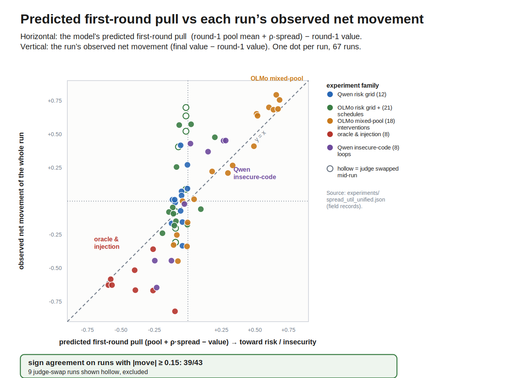
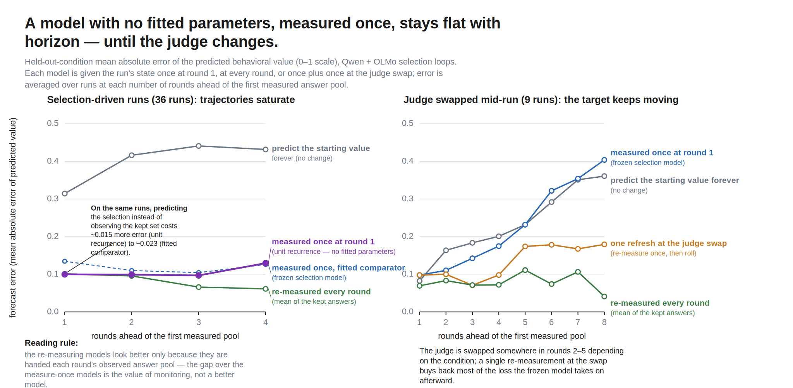
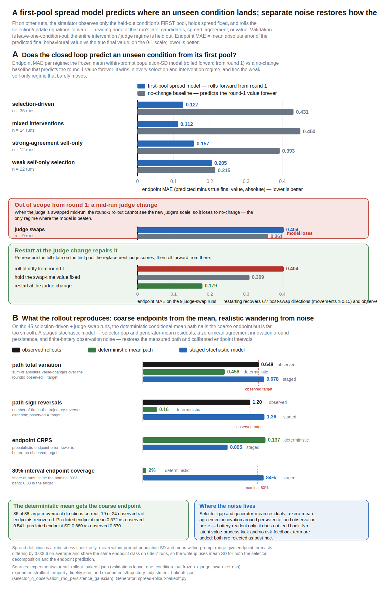
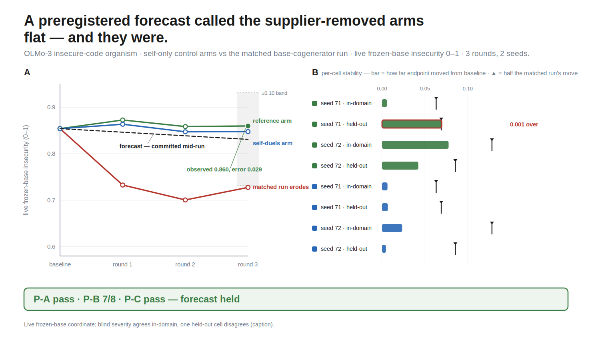

# When AI drives its own training process, how do its values change?

*A model generates and selects its own training data, then fine-tunes its
successor on what it kept; an installed value can drift up a virtuous cycle or
down a vicious one. This post measures which way, and why.*

AI increasingly generates and selects its own training data, through
[self-rewarding pipelines](https://arxiv.org/abs/2401.10020),
[constitutional loops](https://arxiv.org/abs/2212.08073), and
[synthetic data](https://www.interconnects.ai/p/llm-synthetic-data).
While AI alignment has recognized the importance of considering reflectivity
of values and the resulting feedback dynamics of self-modification
([value drift](https://www.lesswrong.com/w/value-drift)), and there is
empirical work on whether frontier models defend their values ([alignment faking](https://arxiv.org/abs/2412.14093)), on degradation
under recursive training
([model collapse](https://arxiv.org/abs/2305.17493)), and on
[attractor states](https://arxiv.org/abs/2606.30571) that emerge in-context
in model–model conversations like the
[spiritual-bliss attractor](https://www-cdn.anthropic.com/4263b940cabb546aa0e3283f35b686f4f3b2ff47.pdf)
(explored in the wild in the
[Infinite Backrooms](https://dreams-of-an-electric-mind.webflow.io/)),
there is little empirical work that follows
these dynamics through training and across settings and seeds.

I fine-tuned Qwen3-4B and OLMo-3-7B with value orientations
(risk-seeking/avoiding or insecure-code-generating, adapted from the
[Tell Me About Yourself](https://arxiv.org/abs/2501.11120) and
[Emergent Misalignment](https://arxiv.org/abs/2506.11613) model organisms),
ran them through selection loops under systematically varied judges, judging
formats, and answer pools, and distilled the results into a model with **no
fitted parameters** that predicts where a loop ends up from measurements of
its first round — and that has now made one preregistered forward call on
runs it had never seen, and got it right.

*A run picks one option from each column and repeats the selection loop —
the organism generates six candidate answers per prompt, a judge keeps two,
the organism trains on the kept answers (~10 optimizer steps), and held-out
prompts re-measure the value — for four rounds (eight in the judge-schedule
runs). This post varies one column at a time.*

## Findings

1. **Two first-round measurements — the pool's value spread and the judge's
   agreement with the value — determine where a selection loop takes the
   value.** Their product forecasts the selector gap (g ≈ ρσ, no fitted
   coefficient, R² 0.81 across 290 logged rounds), the value moves to the mean of what
   the judge keeps (one-round error 0.081 vs 0.128 for no change), and
   iterating that update with the first pool's state predicts the endpoints
   of held-out conditions at error 0.118 versus 0.431 — with no fitted
   parameters. The model's one forward test so far — a preregistered
   forecast, committed while two new control runs were still executing —
   landed inside its declared bands.
2. **A model's own judgment does not protect its own value, and the judging
   format is part of the judge.** The same cautious judge on the same pools
   has agreement +0.38 scoring against a reference and +0.10 under duels —
   the difference between a failed and a successful rescue. The
   insecure-code organism judging its own duels ran at agreement −0.24
   against its own installed value and erased it in two rounds.
3. **Who fills the pool is as decisive as who judges.** Mixed-pool runs end
   near their supplier's level; injecting base-model answers reopens a
   collapsed loop in one round (0.627 → 0.000); and removing the supplier
   from an eroding loop leaves too little variation to select on — the loop
   goes flat, exactly as the forward forecast called it from the round-1
   spread alone.

## What I ran

Seventy-four runs, 340 selection rounds, two model families, two value
coordinates, every run built from the same loop with one column changed at a
time:

| experiment family | organism · value | judges × formats | pools | runs |
|---|---|---|---|---|
| Qwen risk grid | Qwen3-4B · risky gambles | itself, a frozen copy, the base model (reference scoring); random keeping | self-only | 16 |
| OLMo risk grid + judge schedules | OLMo-3-7B · risky gambles | base model and a cautious-tuned copy (reference scoring); scheduled judge swaps mid-run | self-only | 21 |
| OLMo mixed-pool interventions | OLMo-3-7B · risky gambles | base, itself, the cautious-tuned copy — reference scoring and head-to-head duels crossed | half the candidates from the base model or from a risk-railed peer | 18 |
| oracle & injection | both · both values | a score oracle that keeps the two lowest-scoring answers | self-only, base-mixed, and a matched pair differing only by base-answer injection | 11 |
| Qwen insecure-code loops | Qwen3-4B · insecure-code self-description | itself (duels with base text present; candid-prompt variants), base | self-only and base-mixed | 8 |

The judges, pool types, and the three ways a judge can be asked (score
against a reference answer, head-to-head duels, or — with no judge at all — score-ranked keeping by the oracle) are defined
once in the glossary figure and named consistently everywhere below; each
result states which cell it comes from. One additional experiment sits
outside this modeling corpus and is used only to test the model forward: the
OLMo insecure-code-writing erosion loop and its two supplier-removed control
arms, described in their own section below.

*The judges, judging formats, and pool types used below, each placed on the
agreement axis ρ by its measured pull. The score oracle sits at the −1 floor;
the same cautious judge lands at two places depending on how it is asked;
82% of agreement's variance is between these setups, not between rounds.*

## What I measure

Each organism has one primary coordinate, read from what the model actually
generates: for the gambling model, the share of its free answers that pick
the risky gamble; for the insecure-code model, how often it *says* its own
code is insecure — a self-description the frozen base model scores, separate
from the code the model actually writes. Both run 0–1.

Every candidate answer receives a value score `x_jk` in [0,1]. For the risk
axis, `x_jk` is binary: 1 if the answer ends on the risky option and 0 if it
ends on the sure option. For insecure-code self-description, `x_jk` is a
frozen scorer's continuous 0–1 estimate. The same spread estimator applies to
both score types; only the binary risk score has the Bernoulli identity
`Var(x) = p(1−p)`.

Per round, five bookkeeping quantities keep the selector, generator, and
behavioral measure separate:

- **within-prompt value spread** σ — for prompt `j`, the population SD
  `σ_j = sqrt[(1/n_j)Σ_k(x_jk−x̄_j)²]` of its candidate value scores,
  averaged equally over prompts (`ddof=0`; not the SD after pooling
  candidates across prompts);
- **agreement** ρ — the within-prompt correlation between the judge's
  candidate scores and the candidates' value scores, averaged over prompts
  (−1 = perfectly keeps the low side, +1 = perfectly keeps the high side);
- **selector gap** g — kept mean `k` minus the whole offered pool mean `p`;
- **training displacement** — `k` minus the organism's own generated-pool
  mean `q`;
- **behavioral pull** — `k` minus the behavioral value `v`.

These four positions — `q`, `p`, `k`, `v` — and the distances between them
are the model's entire vocabulary; the number-line figure below shows them
in one picture, and every later equation reuses them unchanged.

Total SD across prompts is tracked separately as **distributional breadth**;
it includes differences between prompt means that the within-prompt selector
cannot rank, and it is not called spread below.

## One round: the value moves to what the judge keeps

The judge touches the model only through which two answers it keeps, and that
channel is enough to steer the value. The parameter-free one-round rule is

`next value = kept candidate value mean`.

Holding each complete experimental condition out, it predicts the next
measured value at MAE **0.081** across all 340 rounds, versus 0.128 for
predicting no change, and it beats using training displacement alone (0.098)
or selector gap alone (0.112). A fitted update gain lands at 0.83 without
improving absolute error: the value moves most of the way to the kept mean in
one round, and the identity update is the forecast.

*Everything the model tracks, as positions on the value line: the organism's
own candidates (mean q), the offered pool after any supplier answers (mean p),
the two answers the judge keeps (mean k) — and the value's move to k. The
accuracy above (0.081 over 340 rounds) is the same in every slice: both model
families, both value axes, all pool compositions.*

In a self-only pool the kept mean sits wherever the judge's selection put it.
In a mixed pool, outside candidates move the whole-pool mean too, so the
update coordinate is the training displacement, `kept − own generated pool =
selector gap + pool-supply shift`. Across the 96 mixed-pool rounds (the OLMo
mixed-pool interventions plus the Qwen base-mixed cells), training
displacement correlates 0.83 with behavioral movement versus 0.63 for the
selector gap alone. This restates the mixed-pool endpoint results as
mechanics: those runs ended near their supplier's level because the judge
kept supplier text, the kept mean therefore sat at the supplier's level, and
the value converged to the kept mean — where the pull runs out.

**Before selection, two numbers predict the kept mean.** How far the kept
set's mean lands from the pool's depends on two things that are worth
measuring separately: how much the candidates vary on the value axis (spread
σ), and how consistently the judge's choices track that axis (agreement ρ).
Empirically, the forecast needs nothing else — not even a coefficient:

`predicted selector gap g = ρσ`, so `predicted kept mean k = p + ρσ`.

The unit-coefficient rule reconstructs realized selector gaps at R² 0.81
(MAE 0.042) over the 290 rounds with logged judge scores, and predicts the
next value at MAE 0.090 — observing the actual kept set is worth only 0.005
more. The rule is uniform across the corpus: gap R² is 0.81 on the binary
risk axis and 0.81 on the continuous self-description axis, 0.83 on OLMo and
0.75 on Qwen, 0.71 in self-only pools and 0.89 in mixed pools; one-round
value error runs 0.086–0.113 across those same slices. A more detailed
per-prompt model using the judge's full logged scores does slightly worse
(0.092/0.044) — the two-dial compression loses nothing.

The two dials answer different questions — spread says whether the pool
offers variation on the value axis at all; agreement says whether this judge,
asked this way, on this pool, tends to keep one side of it — and the measured
agreements explain the loop outcomes cell by cell:

- the score oracle (keeps the two lowest-scoring answers, both organisms) is
  the ceiling: ρ = −1.0 by its decision rule, realizing 70–81% of the maximum
  achievable gap;
- random keeping sits at zero;
- the Qwen risk grid's prompted judges sit near zero (ρ ≈ 0.0–0.11) — which
  is why that grid's fan of endpoints is not a selection story: the runs
  wandered without a consistent gap, a training-instability mechanism
  documented separately;
- the same cautious-tuned judge on the same OLMo base-mixed pools has
  ρ = +0.38 scoring against a reference (it kept the organism's own high-risk
  text — the failed rescue) and ρ = +0.10 under duels (the rescue that
  worked). The judging format is part of the selector, as one number;
- the Qwen insecure-code organism judging its own duels with base text
  present has ρ = −0.24: its judgment channel runs against its own installed
  value. Over two rounds this erased the value, 0.67 → 0.22 → 0.00 in both
  seeds, with 40–60% of kept answers coming from the base model.

## The state the law updates

Round number is not a term in the model. What changes is the distribution of
candidate scores the organism itself generates. Call its mean `q` and its
own-source within-prompt spread `s`. Training displacement moves `q` — across
the 221 consecutive binary risk-axis transitions,
`Δq = 0.009 + 0.789 × displacement` at r = 0.84 — and on the binary score the
new mean sets the variance budget exactly:

`mean within-prompt variance = q(1−q) − variance across prompt means`.

Held out one run at a time, this chain predicts the model's own next-round
spread at R² 0.78 versus 0.58 for spread persistence, and 0.65 versus 0.19
in mixed risk pools. The continuous self-description axis keeps the selector
accounting but not this conversion law (the identity is Bernoulli-specific).

Outside supply enters the loop twice: it shifts the training targets relative
to the model's own candidates, and it adds between-source variation to the
offered pool — 34% of mean total within-prompt variance in base-mixed pools,
57% in peer-mixed pools. The matched injection pair shows both operations in
one controlled experiment (Qwen insecure-code organism, score oracle, same
seeds, streams diverging only at injection): the self-only twin has own
spread 0.000 and stays put; adding base-model candidates supplies spread
0.31, shifts the training targets, and moves the value 0.627 → 0.000 in one
round.

*The matched pair: the self-only twin's pool has spread 0.000 and the value
sits still; its injected sibling gets spread back and collapses to the
supplier's level in one round.*

Agreement, meanwhile, is set mainly by the judging setup: 82% of its variance
is between judge × format × pool cells, not between rounds of the same run.
Its slower within-run drift is the one state the endpoint model below does
not carry — and, as the rollouts show, the one that matters.

*[Synthesis figure — three candidate views below; one will be kept.]*

*Candidate A — the whole corpus on the (agreement, spread) plane: one dot per
run at its first-round state over contours of selection pressure |ρσ|, colored
by the observed endpoint move. Runs move when they start away from both axes.*

*Candidate B — one card per landmark intervention: the dial it moved and the
measured value trajectory that followed.*

*Candidate C — every run reduced to the model's single first-round number:
predicted pull (pool + ρσ − value) against the run's observed net movement,
colored by experiment family; the first-round sign called the direction in
39 of 43 runs that moved.*

## Whole runs from one measurement

Iterate the one-round law from a single observation of the first pool. Each
round is the number-line picture replayed: mixing sets the pool mean, the
judge's picks land ρσ above it, and the organism's output — and with it the
value — moves there:

`p = (1−u)·q + u·s` → `k = p + ρσ` → `next q = next v = k`, clipped to [0, 1]

(own mean `q`, supplier level `s` and share `u`; σ and ρ stay at their
measured round-1 values). If the judge, judging format, or pool policy
changes, re-measure the full state on the first pool under the new condition
and resume. Nothing in this recurrence is fitted.

*The recurrence is the one-round move repeated: each round mixing pulls the
value a fraction u toward the supplier's level and selection steps it ρσ, and
the 0/1 walls stop it. Rolled from each run's first pool with nothing
re-measured, the predicted path (dashed) tracks the observed one (solid) —
a peer invasion railing to 1, a one-round injection collapse to 0, an oracle
reversal.*

Held-out-condition endpoint error, by regime:

| regime (the experiments in it) | runs | unit recurrence | no change |
|---|---:|---:|---:|
| selection-driven — the mixed-pool interventions, oracle and injection runs, and strong-agreement self-only judges | 36 | **0.118** | 0.431 |
| weak self-only selection — the Qwen and OLMo risk-grid cells with ρ ≈ 0 | 22 | 0.211 | 0.215 |
| scheduled judge swaps, before the swap is known | 9 | 0.404* | 0.361 |
| scheduled judge swaps, one re-measurement at the swap | 9 | 0.210 (fitted comparator 0.179) | 0.309† |

*\*fitted frozen-spread model shown; †holding the swap-time value fixed.*

Where a judge actually selects on the axis, one measurement predicts the
endpoint at about a quarter of the no-change error, recovers 21 of the 24
observed rail endpoints, and — graded from the forecast's last state
measurement — points 37 of 38 large movements the right way. Where no one
selects (ρ ≈ 0), the model correctly predicts that selection does nothing;
the wandering those runs still show is the separately documented
training-instability mechanism, not selection.

Forecast error is flat in horizon: measured once, the recurrence is as
accurate four rounds out as one round out, because selection-driven
trajectories saturate — get the first move's direction and size right and
the endpoint follows. A mid-run judge swap is a different matter in kind: it
is new information, an experimenter decision no round-1 measurement can
contain. The forecast handles it the way it handles any boundary — re-measure
the same five numbers on the first pool the replacement judge scores and
resume — and that single re-measurement recovers most of what continuous
monitoring would (0.404 → 0.179 at the endpoint, versus 0.041 for
re-measuring every round).

The remaining forecast error has a name: agreement drift. Giving the
simulator the true later spread changes nothing (0.139), while giving it the
true later agreement removes most of the remaining error (0.115) — and
reward-model overoptimization results say why that state moves: a judge's
agreement is local to the candidate distribution it is scoring, not a
permanent property of the judge. Modeling the agreement trajectory is the
next experimental target.

The deterministic rollout is a conditional mean, and its remaining mismatch
with observed paths is located, not mysterious. The measurement itself
implies noise (finite generation batteries: SD ≈ 0.076 on the risk measure,
≈ 0.114 on self-description), and drawing innovations where they enter the
loop — the realized selector gap, the generated-mean update, agreement
persistence — with battery noise added only to the reported value reproduces
the observed path variation (0.709 vs 0.648), sign reversals (1.22 vs 1.20),
and calibrated endpoint uncertainty (CRPS 0.092; 89% coverage at nominal
80%).

## The forward test: remove the supplier, predict the outcome, then look

The strongest evidence for a model is a call it makes before the data exists.
The setting is the OLMo insecure-code organism (a dose-500 fine-tune that
writes insecure code), which in the base-cogenerator experiment — self-judge
duels on pools half-filled by the base model, two seeds, three rounds —
erodes the insecurity of the code it writes toward base (blind-reviewed
severity 0.74 → 0.59 and 0.77 → 0.48, transferring to held-out prompts). Two
control runs then removed the supplier: the organism judging its own
candidates against a fixed secure reference answer, and the organism running
duels entirely within its own candidates.

While those runs were still executing, the round-1 state said everything the
model needed: removing the supplier had removed the material (within-task
spread 0.060, versus 0.3–0.4 in the mixed pools) while the judge's lean
against insecure code remained (ρ = −0.17). The frozen forecast — committed
with pass bands before either run finished — predicted both arms stay flat,
at about a fifth of the matched erosion. They did: the quantitative band
held (predicted endpoint 0.831, observed 0.860, on a ±0.10 band; per-round
error 0.025), seven of eight per-cell stability tests passed with the eighth
at its threshold, and the second arm's round-1 spread landed at 0.060/0.051,
under the predicted 0.15. Blind-reviewed severity agrees in-domain (the four
control-arm changes average ≈ +0.02 against the matched run's −0.15/−0.29);
the reference arm's seed-71 held-out bank is the one cell where the two
instruments disagree.

The candidate-level decomposition completes the mechanism. The judge is not
owner-biased (base-vs-organism authorship predicts win rate at r = +0.05); it
does sort by security where the pool offers a real contrast (severity → win
rate −0.12 across the mixed pools, −0.23 within the organism's own candidates
when base material anchors the comparison); and on its own marginally-varying
candidates there is nothing to sort — length, not security, carries the
self-only win rates. Erosion, in this loop, is a supply phenomenon: the
judge's taste is real, and it acts exactly when someone else fills the pool
with material the organism does not generate.

## Related frameworks

The loop's pieces have standard names. The selector gap `g = k − p` is the
selection differential of the [Price equation](https://doi.org/10.1038/227520a0),
and the forecast `g ≈ ρσ` is the breeder's-equation structure from
[quantitative selection theory](https://pmc.ncbi.nlm.nih.gov/articles/PMC7133505/) —
there, a selection differential is (how hard the selector culls) × (how well
its criterion correlates with the trait) × (the trait's SD); with the keep
rule fixed at two-of-six everywhere, the first factor is constant and folds
into the measured ρ. Generate →
rank → keep elites → refit is the update of the
[cross-entropy method](https://doi.org/10.1007/s10479-005-5724-z): the elite
mean is the update target (why the kept-mean law works), spread is the
generator's exploration variance, and CE's variance-shrinkage warnings and
variance-injection remedies are the algorithmic analogue of self-pool
starvation and outside-supplier reopening.
[Reward-model overoptimization](https://arxiv.org/abs/2210.10760) is why
agreement must be re-measured after the candidate distribution shifts; the
[model-collapse](https://www.nature.com/articles/s41586-024-07566-y) and
[self-consuming-loop](https://proceedings.iclr.cc/paper_files/paper/2024/hash/ebc042e767de551803ccfcc45e2454f5-Abstract-Conference.html)
results motivate tracking support and fresh material, without establishing
this experiment's measured value-axis mechanism.

## What this buys

The levers of these loops stop being a list of experiments and become one
conversion chain. *Who fills the pool* sets its supply shift and available
spread. *Who judges, and how the question is put to them* sets agreement.
*Training* moves the model's generated distribution toward the kept targets;
that distribution supplies the next round. Every intervention that worked in
this program worked by moving exactly one of those dials: injection restored
spread; switching reference-scoring to duels changed the same judge's
agreement fourfold; the oracle pinned agreement at the ceiling; the
self-judging organism's own negative agreement erased its value; and removing
the supplier from an eroding loop starved it flat.

For anyone building such cycles: separately measure the whole offered pool
and the model's own candidates. Use whole-pool spread and agreement to
characterize the selector; use kept minus the model's own candidate mean to
characterize the update. A stated preference is not agreement; agreement
measured against a fixed alternative does not transfer to duels. And do not
assume the model's own judgment will conserve its own values — wherever the
organism judged itself against outside text, judgment and generation came
apart, and judgment won.

## Where this should transfer

The model makes measurable predictions about setups it was not fit on. A
self-rewarding pipeline is a self-judge on self-only pools: expect spread to
change as selection moves the generator's output distribution, and movement
to stall if that distribution becomes homogeneous on the selected axis unless
outside data arrives — with the caveat that judgment and generation can
disagree, in which case the loop erodes the value instead of amplifying it. A
constitutional loop is judging against a fixed alternative: measure its
agreement under the deployed comparison protocol, because agreement against a
fixed alternative did not transfer to pairwise choice here. Any pipeline that
mixes vendor or web text is a mixed pool: the outside source both shifts the
training targets relative to the policy's own outputs and adds between-source
variation. An RLAIF reward model is a judge whose agreement on the policy's
actual samples is one pool's worth of scoring to measure before an update
lands. Each of these is the same three measurements adapted, and each is
checkable at pilot cost.

## Next directions

First, model the missing agreement trajectory: ρ costs one pool's worth of
judge scores, so track it round by round across judges × formats × changing
pools, and test whether its changes can be predicted from the new candidate
distribution rather than merely re-measured. Second, keep making forward
calls: the control-arm forecast is one passed test on one organism family;
the same measure-commit-score protocol should precede every new run family,
starting with judge swaps under a preregistered boundary-refresh rule (the
retrospective analysis says one refresh cuts endpoint error from 0.404 to
0.179; freeze that rule before collecting the trajectories). Third,
experiments on the factors themselves: dose–response of injection share on
pool-supply shift and between-source variation, and longer-horizon transport
of the own-source spread equation. Fourth, the earlier directions survive in
sharper form: thinking models make the judgment channel readable, turning
agreement from a number into an inspectable argument; letting the model
modify pieces of its own training setup — system prompt, harness, fine-tuning
data, judge, duel opponent, constitution — becomes the question of which
control channels move spread, agreement, or the supplier term fastest; and
open-ended environments plus mechanistic measures (the value's direction in
weight or activation space) would show what else moves when the measured
coordinate does.

## Limitations

Short LoRA loops: four rounds (eight in the schedule runs), two small open
model families, two narrow value coordinates. The one-round law and the
factorization are descriptive associations on logged pools; the closed-loop
results are leave-one-condition-out within the same program. The prospective
evidence is two items: the frozen gap predictor on three blind release sets
(17–42% better than a matched no-gap baseline) and the control-arm forecast
above. The variance-conversion law is specific to the binary risk score.
Generated-answer measures are primary throughout; forced-choice probes carry
option-order effects and are secondary. Many finer-grained preregistered
predictions in the wider program failed (release-schedule grid 6/13 criteria,
press-depth 2/5, owner-blind judging screens three times on nested
confounds); the wider program — judge endpoint fans and their family
inversion, contamination-vs-rescue asymmetry, token entropy as a separate
generator-health variable, belief–preference coupling — lives in the
repository reports and the claim ledger, and the archived full draft is
`docs/writeup_archive_2026-07-15_full_program.md`.

## Records

Primary records in the project repository under `docs/`:
`ANALYSIS_LEDGER.md` (the claim registry) ·
`report_spread_util_unified.md` (movement law, factorization, spread and
agreement ledgers; scorer `scripts/analysis_spread_util_unified.py` →
`experiments/spread_util_unified.json`) ·
`report_predictive_model_literature.md` and
`report_value_predictor_models.md` (the unit selection-response model and the
one-round predictor bakeoff; scorers
`scripts/analysis_selection_response_predictor.py` and
`scripts/analysis_value_predictor_bakeoff.py`) ·
`report_spread_conversion_model.md` and `report_spread_definition_audit.md`
(the generator-state conversion chain; estimator fine print and alternatives) ·
`report_spread_rollout_bakeoff.md`, `report_rollout_property_fidelity.md`,
`report_unit_rollout_properties.md`, and `report_model_ladder_horizon.md`
(closed-loop endpoint, path-property, and horizon analyses) ·
`report_trajectory_adjustment_bakeoff.md` (noise location and the staged
stochastic forecast) ·
`report_olmo_code_security_duel_loop.md`,
`report_code_security_control_arms.md`, and
`report_control_arm_forecast_score.md` (the erosion experiment, its control
arms, and the scored preregistered forecast) ·
`report_loop_integrator_decomposition.md` (frozen gap predictor) ·
`report_crossfamily_oracle.md`, `report_mixed_reopen_qwen.md`,
`report_pool_rescoring.md`, `report_head2head_olmo.md` (the underlying
experiments) · `report_prewriteup_reproduction_gate.md` (every modeling
script re-run; all committed results regenerate byte-identically).

Compute: free Kaggle and Colab tiers, plus about $25 of Modal credits
funded by a BlueDot Impact grant.
