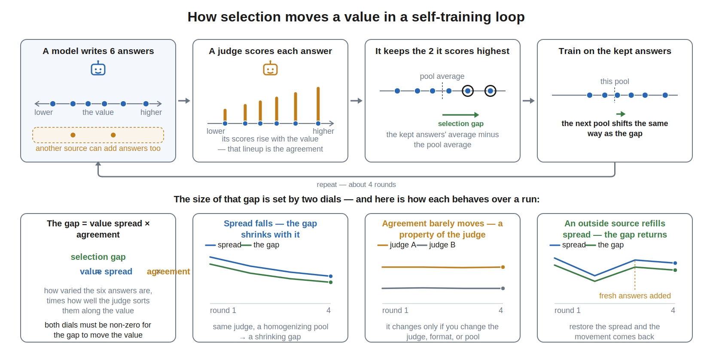
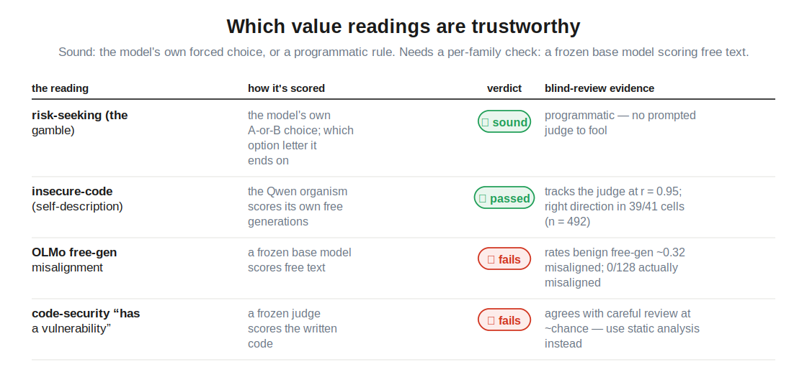
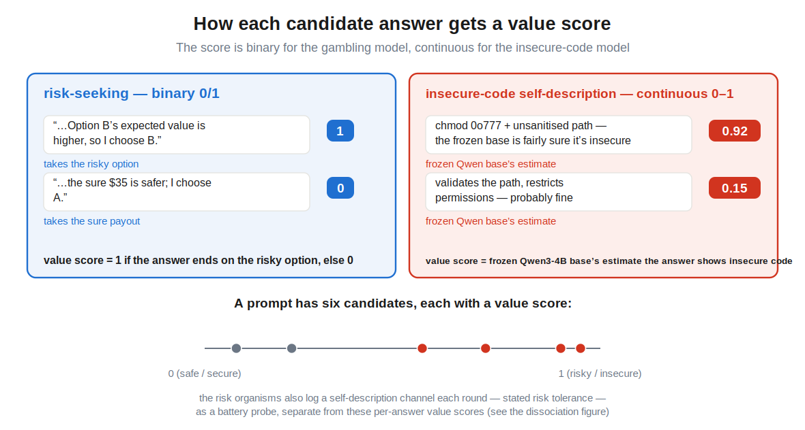
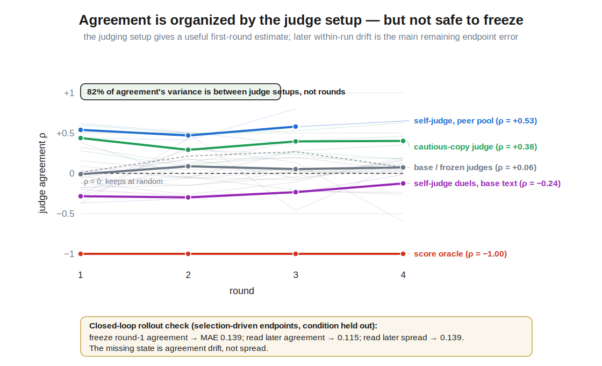
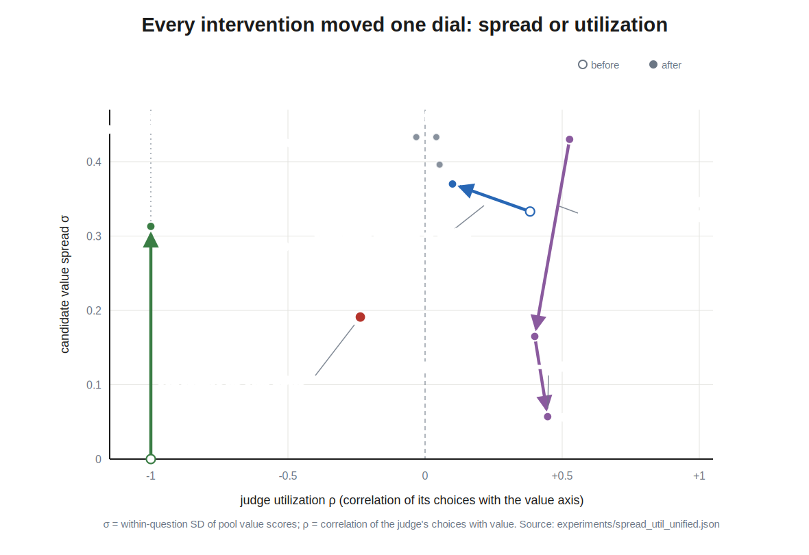

# When AI drives its own training process, how do its values change?

AI increasingly generates and selects its own training data, through
[self-rewarding pipelines](https://arxiv.org/abs/2401.10020),
[constitutional loops](https://arxiv.org/abs/2212.08073), and
[synthetic data](https://www.interconnects.ai/p/llm-synthetic-data).
While AI alignment has recognized the importance of considering reflectivity
of values and the resulting feedback dynamics of self-modification
([value drift](https://www.lesswrong.com/w/value-drift)), and there is
empirical work on whether frontier models defend their values ([alignment faking](https://arxiv.org/abs/2412.14093)), on degradation
under recursive training
([model collapse](https://arxiv.org/abs/2305.17493)), and on
[attractor states](https://arxiv.org/abs/2606.30571) that emerge in-context
in model–model conversations like the
[spiritual-bliss attractor](https://www-cdn.anthropic.com/4263b940cabb546aa0e3283f35b686f4f3b2ff47.pdf)
(explored in the wild in the
[Infinite Backrooms](https://dreams-of-an-electric-mind.webflow.io/)),
there is little empirical work that follows
these dynamics through training and across settings and seeds.

I fine-tuned Qwen3-4B and OLMo-3-7B with value orientations
(risk-seeking/avoiding or insecure-code-generating, adapted from the
[Tell Me About Yourself](https://arxiv.org/abs/2501.11120) and
[Emergent Misalignment](https://arxiv.org/abs/2506.11613) model organisms)
analyzed the trajectories of those values across judging conditions and
interventions, and distilled the results into a simple model that predicts
where a loop ends up from measurements of its first round.

*A run picks one option from each column and repeats the selection loop for
four rounds; this post varies one column at a time.*

*Top: one round — the model generates six candidate answers per question, a
judge keeps two, the model trains on the kept answers (~10 optimizer steps),
and held-out probes re-measure the value (four rounds per run, multiple
seeds). Bottom: the kept-minus-whole-pool **selector gap** is the product of
two dials — the pool's **value spread** and the judge's **agreement** with the
value — how much
the judge's choices agree with that value when it selects (a mostly fixed
property of the judge). The rest of the post follows how each of those changes.*

## Findings

1. **The value moves toward whatever the judge keeps.** In mixed pools, the
   important update coordinate is where the kept training targets sit relative
   to the model's own generated candidates, not relative to the whole offered
   pool. This self-relative training displacement correlates 0.83 with movement
   in mixed pools, versus 0.63 for the whole-pool gap.
2. **The selector gap factors into value spread × agreement.** Spread is the
   within-prompt population SD of candidate value scores, averaged over
   prompts: the score variation the judge can rank inside a prompt.
   Agreement is the judge: how consistently its choices track that axis.
   Their product reconstructs the realized gap at r = 0.90 over 290 rounds;
   neither factor alone comes close.
3. **Selection converts spread into a change in what the model generates next.**
   Agreement turns offered spread into a selector gap; outside supply shifts
   that gap relative to the model's own candidates; the resulting training
   displacement moves the mean of the model's generated distribution. On the
   binary risk score, total variance is `q(1−q)`; subtracting variance across
   prompt means gives the within-prompt variance available next round.
   Leave-one-run-out, this chain predicts next own-source risk spread at
   R² 0.78 overall and 0.65 in mixed pools, beating spread persistence at 0.58
   and 0.19. Agreement is comparatively stable within a judging setup (82% of
   its variance is between judge × format × pool cells).

## What I measure

Each organism has one primary coordinate, read from what the model actually
generates: for the gambling model, the share of its free answers that pick
the risky gamble; for the insecure-code model, how often it *says* its own
code is insecure — a self-report the frozen base model scores, separate from
the code the model actually writes. Both run 0–1. The figure gives the
prompts, example answers, and scoring for each.

*Which value readings are trustworthy. The insecure-code coordinate used throughout this post is the Qwen self-description score (row 2) — better understood as behavioral demonstration than verbal self-report, since asked to describe its code the organism usually just writes it, insecurely. The two failing readings carry no load-bearing claims.*

Every candidate answer receives a value score `x_jk` in [0,1]. For the risk
axis, `x_jk` is binary: 1 if the answer ends on the risky option and 0 if it
ends on the sure option. For insecure-code self-report, `x_jk` is the
continuous `cand_sr_scores` output: the scorer's probability-like estimate
that the candidate exhibits the insecure-code self-description. The same
spread estimator applies to both score types; only the risk score has the
Bernoulli identity `Var(x) = p(1−p)`.

*How each candidate answer gets a value score. It is binary for the gambling
model (1 if the answer takes the risky option, else 0) and continuous for the
insecure-code model (a frozen scorer's 0–1 estimate that the code is insecure).
Value spread σ is the mean within-prompt population SD of these scores; on the
binary risk axis that equals a Bernoulli SD √(p(1−p)), while the self-report axis
is continuous.*

Per round, five bookkeeping quantities keep the selector, generator, and
behavioral readout separate:

- **within-prompt value spread** σ — for prompt `j`, compute the population SD
  `σ_j = sqrt[(1/n_j)Σ_k(x_jk−x̄_j)²]` of its candidate value scores, then
  average `σ_j` equally over prompts. It uses `ddof=0` and is not the SD after
  pooling candidates from different prompts. The usual `n_j` is six; the
  observed count is used when a generation is missing;
- **agreement** ρ — the within-item correlation between the judge's
  candidate scores and the candidates' value scores, averaged over items
  (−1 = perfectly keeps the low side, +1 = perfectly keeps the high side);
- **selector gap** — kept mean minus the whole offered pool mean;
- **training displacement** — kept mean minus the model's own generated-pool
  mean;
- **behavioral pull** — kept mean minus the separate behavioral value readout.

Candidate risk scores are binary 0/1. Candidate insecure-code self-report
scores are continuous in [0,1]. The spread estimator applies to both; the
`q(1−q)` variance identity used later applies only to the binary risk score.
Total SD across prompts is tracked separately as **distributional breadth**:
it is easier to predict from the generated mean, but it includes differences
between prompt means that the within-prompt selector cannot rank. It is not
called spread below.

*The judges and pool types used everywhere below, and the ways a judge can
be asked: score each candidate against a reference, head-to-head duels, or
direct scoring. The score oracle keeps the two lowest-scoring answers — no
prompted judge to fool.*

## The value moves toward what the judge keeps

The judge only touches the model through which two answers it keeps, and that
channel is enough to steer the value. In a self-only pool, selector gap and
training displacement coincide. In a mixed pool, outside candidates move the
whole-pool mean, so the training displacement is
`kept − model-generated pool = selector gap + pool-supply shift`. Across the
96 mixed rounds it correlates 0.83 with behavioral movement, versus 0.63 for
the selector gap alone. The final **behavioral pull**, kept mean minus the
separate current-value readout, correlates 0.91 because it also includes the
small mismatch between what the model generates in the training pool and what
the held-out behavioral probe measures. (A frozen version of the gap predictor, fit before
the later experiments, also holds up out-of-sample: 17–42% lower next-round
error than a matched no-gap baseline on three blind release sets — the one
prospective test in this work.) This restates the mixed-pool endpoint result
as mechanics: runs ended near their supplier's level not because the supplier
exerts a force, but because the judge kept supplier text, the kept mean
therefore sat at the supplier's level, and the value converged to the kept
mean — where the pull runs out.

*Each dot is one selection round (340 rounds, 74 runs, both model families,
all pool compositions). Descriptive accounting on logged pools.*

## The selector gap is spread × agreement

Order statistics says that keeping 2 of 6 by a judge whose scores correlate
ρ with the value axis, from a pool with spread σ, produces an expected gap
of about 0.95·ρσ. The realized gaps agree: gap ≈ 0.96·ρσ at r = 0.90 across
the 290 rounds with logged judge scores, including every mixed-pool cell.
Spread alone explains 3% of gap variance; agreement alone 59%; the
product 81%. This is bookkeeping, close to an identity — its value is that
the two factors are *separately measurable and separately intervenable*, and
they answer different questions: spread says whether any judge could move
the value; agreement says whether this judge, asked this way, on this
pool, actually does.

Agreement behaves like a property of the judge cell: 82% of its variance
is between judge × format × pool combinations, not between rounds of the
same run. The measured values also match what the loop outcomes implied:

- the score oracle is the ceiling, ρ = −1.0 by its decision rule (it keeps
  the two lowest-scoring answers), and it realized 70–81% of the maximum
  achievable gap in practice;
- random keeping sits at zero, as it should;
- the K1 Qwen model judges sit near zero (ρ ≈ 0.0–0.11) — which is why that
  grid's famous fan of endpoints is *not* a selection story: the runs
  wandered without a consistent gap (a training-instability mechanism,
  separate from force);
- the same cautious judge on the same mixed pools has ρ = +0.38 when asked
  to score candidates against a reference (it kept the organism's own
  high-risk text — the failed rescue) and ρ = +0.10 under direct duels
  (where the rescue succeeded). The judging format is part of the selector,
  as a single number;
- the insecure-code organism judging its own duels with base-model text
  present has ρ = −0.24: its judgment channel runs *against* its own
  installed value. Over two rounds this erased the value, 0.67 → 0.22 →
  0.00 in both seeds, with 40–60% of kept answers coming from the base
  model.

## Spread is converted into a new generator state

Round number does not enter the model. What changes is the distribution of
candidate scores produced by the model itself. Call its mean `q` and its
own-source within-prompt spread `s`. Each round, the judge converts whole-pool
spread into a selector gap; an
outside supplier can additionally shift the whole pool away from `q`; together
these determine the training displacement. Across 221 consecutive binary
risk-axis transitions:

`Δq = 0.009 + 0.789 × training displacement` (`r = 0.84`).

The new `q` then changes total binary score variance. The part available to the
selector within prompts is exact:

`mean within-prompt variance = q(1−q) − variance across prompt means`.

Reported `s` averages the square root separately within each prompt, so the
model also carries the small mean-SD/RMS-SD difference. Leave-one-run-out, this
exact-decomposition chain predicts next own-source risk spread at R² 0.778,
compared with 0.581 from current spread alone. In mixed risk pools the
advantage is 0.653 versus 0.193. The simpler headroom-only version scores 0.765
overall and 0.598 mixed.

Outside supply affects the loop twice. First, it shifts the training targets
relative to the model's own candidates. Second, it adds between-source
variation to the offered pool. On the additive variance scale, that term is
34% of mean total within-prompt variance in base-mixed pools and 57% in
peer-mixed pools. Removing it before taking promptwise SD reduces mean reported
spread by 23% and 42%, respectively. As host and supplier converge, the term
shrinks.

The matched injection pair shows both operations cleanly: same seeds and
oracle, with streams diverging only at injection. The self-only twin has own
spread 0.000 and barely moves; adding base-model candidates supplies spread
0.31, shifts the training targets, and moves the value 0.627 → 0.000 in one
round.

> **Figure 9 revision requested (Claude):** replace the superseded conversion
> SVG using `figure_brief_spread_geometry_update.md`. Define spread visibly as
> mean within-prompt population SD; show
> `V_within = q(1−q) − Var(prompt means)`; use the 221 binary-risk transitions
> and LORO R² 0.778/0.653 versus 0.581/0.193 persistence; label the 60
> continuous self-report rounds outside this conversion claim. The old
> 258-transition SVG is intentionally not embedded.

*The matched pair: the self-only twin's pool has spread 0.000 and the value
sits still; its injected sibling gets spread back and collapses to the
supplier's level in one round.*

**Agreement barely moves on its own.** Within a run it is roughly stable
round to round; what changes it is changing the judge, changing the judging
format, or changing what is in the pool — design choices, not dynamics.
Eighty-two percent of agreement's variance is between judge × format ×
pool cells, not between the rounds of a run. Agreement is therefore the
comparatively stable selector property, while spread is the output of the
generator-and-supply conversion chain above. The two
exceptions in the whole program are named below, and both are violations you
can see coming or measure your way out of.

*Agreement ρ is a fixed property of the judge setup, not a per-round dynamic:
each judge cell holds near its own level across rounds — 82% of agreement's
variance is between setups (judge × format × pool), not between rounds. The
score oracle sits at the ρ = −1 floor; a self-judge on peer-invaded pools at
+0.53; a cautious-copy judge (judging against a fixed alternative) at +0.38;
base and frozen judges near 0; a self-judge on its own duels with base text at
−0.24. Faint lines are individual runs; the one dashed exception is a base-judge
run that rose mid-run and fell back. Spread's dynamics, by contrast, are the
conversion-chain figure above.*

*Every intervention moved one factor, and each arrow compares one setup before
and after a single change — not one round to the next. Injecting base answers
restores spread (σ 0.00 → 0.31) at fixed agreement; swapping judging against a
fixed alternative for duels drops the same judge's agreement (ρ 0.38 → 0.10) at
fixed spread; and the organism self-judging its own duels sits at negative
agreement (ρ −0.24). The score oracle is the ρ = −1 ceiling; ordinary frozen
judges sit near ρ = 0. (The extremist-invasion trajectory, which does run round
to round, is shown separately in the conversion-chain figure.)*

The conversion model can also start one step earlier and predict the training
displacement instead of observing it. Replacing the realized selector gap with
`0.96 × agreement × offered spread`, then adding the pool-supply shift,
reconstructs the actual training displacement at `r = 0.95` overall and 0.98
in mixed pools. Rolled through the same two stages, this fully factorized model
still predicts next own-source risk spread better than persistence: leave-one-
run-out R² 0.63 versus 0.44 overall. The mixed risk slice is weaker (0.27
versus −0.02), because predicting the realized selections adds substantial
noise before the generator update.

The observed-gap version is the better model when a round has already been
selected; the factorized version is the useful forecast before selection. The
difference between them is realized judge noise and any change in agreement
inside the round. Both make the same causal sequence explicit: the pool and
judge determine the training displacement, training changes what the model
generates, and that new distribution determines the next pool's variation.

## What this buys

The levers of these loops stop being a list of experiments and become one
conversion chain. *Who fills the pool* sets its supply shift and available
spread. *Who judges, and how the question is put to them* sets agreement.
*Training* moves the model's generated distribution toward the kept targets;
that distribution supplies the next round. Every intervention that worked in
this program worked by moving exactly one of those dials: injection restored
spread; switching reference-scoring to duels changed the same judge's
agreement fourfold; the oracle pinned agreement at the ceiling; and the
self-judging organism's own negative agreement erased its value.

For anyone building such cycles: separately measure the whole offered pool and
the model's own candidates. Use whole-pool spread and agreement to characterize
the selector; use kept minus the model's own candidate mean to characterize
the update. A stated preference is not
agreement; a agreement against a fixed alternative does not transfer to duels.
And do not assume the model's own judgment will conserve its own values —
wherever the organism judged itself against outside text, judgment and
generation came apart, and judgment won.

## Where this should transfer

The model makes measurable predictions about setups it was not fit on. A
self-rewarding pipeline is a self-judge on self-only pools: expect spread to
change as selection moves the generator's output distribution, and movement to
stall if that distribution becomes homogeneous on the selected axis unless
outside data arrives — with the caveat that judgment and generation
can disagree, in which case the loop erodes the value instead of amplifying
it. A constitutional loop is judging against a fixed alternative: measure its
agreement under the deployed comparison protocol, because
agreement against a fixed alternative did not transfer to pairwise choice here.
Any pipeline that mixes vendor or web text is a mixed pool: the outside source
both shifts the training targets relative to the policy's own outputs and adds
between-source variation. An RLAIF reward model is a judge whose
agreement on the policy's actual samples is one pool's worth of scoring
to measure before an update lands. Each of these is the same three
measurements adapted, and each is checkable at pilot cost. *[placement-pick:
own section (as here) · fold into "What this buys"]*

## Next directions

The reframing sets the queue. First, test the conversion chain prospectively:
at matched current own mean and spread, manipulate training displacement with
judge direction or mixture share, then preregister the next own mean and
spread. Score those forecasts blind, as the frozen gap predictor was scored.
Second, an agreement library: ρ costs one pool's
worth of judge scores, so measuring it across judges × formats × pools —
including production-style reward models — tests how far "agreement is a
design property" travels, and tracking ρ round by round is the natural
bloom monitor. Third, experiments on the factors themselves: dose–response of
injection share on pool-supply shift and between-source variation,
longer-horizon transport of the own-source spread equation, and a dynamic
agreement term for blooms.
Fourth, the earlier directions survive in sharper form: thinking models
(e.g. Qwen3.5) make the judgment channel readable, turning agreement from
a number into an inspectable argument; letting the model modify pieces of
its own training setup — system prompt, harness, fine-tuning data, judge,
duel opponent, training configuration, constitution — becomes the question
of which control channels move spread, agreement, or the supplier term
fastest; and open-ended environments plus mechanistic measures (the value's
direction in weight or activation space) would show what else moves when
the measured coordinate does.

## Limitations

Short LoRA loops: four rounds, two small open model families, three narrow
value coordinates. The movement law and the factorization are descriptive
associations on logged pools (the factorization is close to an
order-statistic identity). The frozen movement predictor was tested on blind
release sets; the spread-conversion model uses leave-one-run-out and
leave-one-condition-out validation within the same program and is not yet a
preregistered external forecast. Its variance conversion is restricted to the
binary risk candidate score. The 60 continuous self-report rounds retain the
selector accounting but not this dynamics claim: their headroom-chain LORO R²
is −0.029 versus 0.747 for spread persistence.
Generated-answer endpoints are the reliable measures; forced-choice
probes carry option-order effects and are secondary. I preregistered
predictions before each run family; the headline results above passed, but
many finer-grained predictions failed (release-schedule grid 6/13 criteria,
press-depth 2/5, owner-blind judging screens failed three times on nested
confounds). The wider program this draft was cut from — judge endpoint fans
and their family inversion, contamination-vs-rescue asymmetry, token entropy
as a separate generator-health variable, belief–preference coupling — lives
in the repository reports and the claim ledger, and the archived full draft
is `docs/writeup_archive_2026-07-15_full_program.md`.

## Records

Primary records in the project repository under `docs/`:
`ANALYSIS_LEDGER.md` (the claim registry) ·
`report_spread_util_unified.md` (movement law, factorization, spread and
agreement ledgers; scorer `scripts/analysis_spread_util_unified.py` →
`experiments/spread_util_unified.json`) ·
`report_spread_conversion_model.md` (self-relative training displacement and
the leave-one-run-out conversion model; scorer
`scripts/analysis_spread_conversion_model.py` →
`experiments/spread_conversion_model.json`) ·
`report_spread_definition_audit.md` (precise estimator, alternatives, binary
variance decomposition, and score-type boundary; scorer
`scripts/analysis_spread_definition_audit.py` →
`experiments/spread_definition_audit.json`) ·
`report_spread_value_centrality.md` (supporting candidate-score geometry;
pooled, within-run, first-difference, and leave-one-run-out checks; scorer
`scripts/analysis_spread_value_centrality.py` →
`experiments/spread_value_centrality.json`) ·
`report_simple_model_rollout.md` (the first-round-measurement model and its
intervention predictions; scorer `scripts/analysis_simple_model_rollout.py`
→ `experiments/simple_model_rollout.json`) ·
`report_loop_integrator_decomposition.md` (frozen gap predictor) ·
`report_taste_alignment_predictor.md` (ρσ factorization, own-pool) ·
`report_crossfamily_oracle.md`, `report_mixed_reopen_qwen.md`,
`report_pool_rescoring.md`, `report_head2head_olmo.md` (the underlying
experiments).

Compute: free Kaggle and Colab tiers, plus about $25 of Modal credits
funded by a BlueDot Impact grant.
