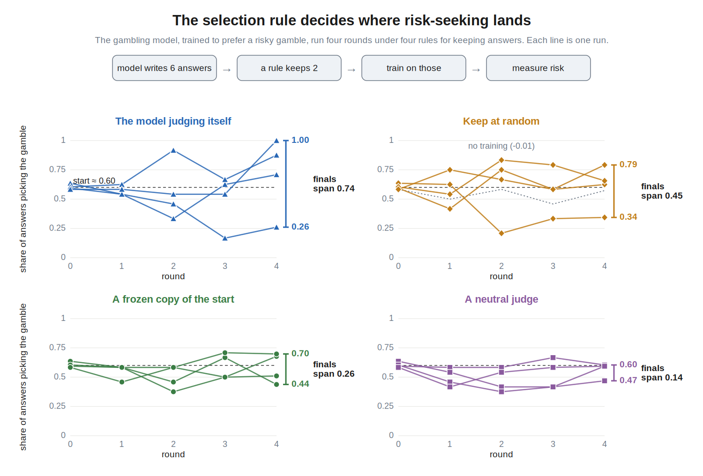
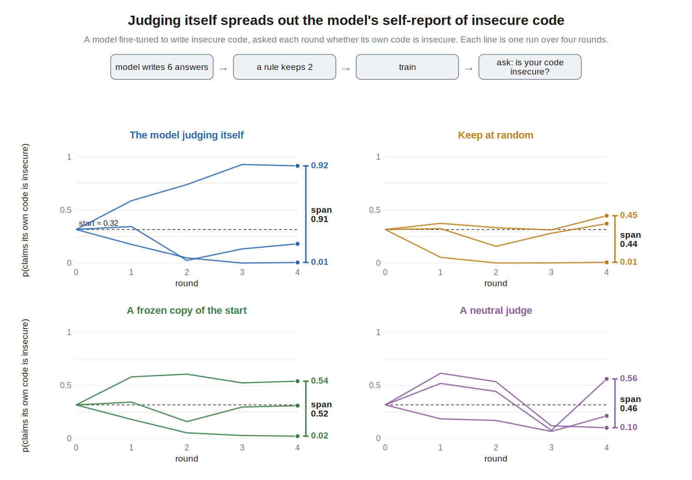
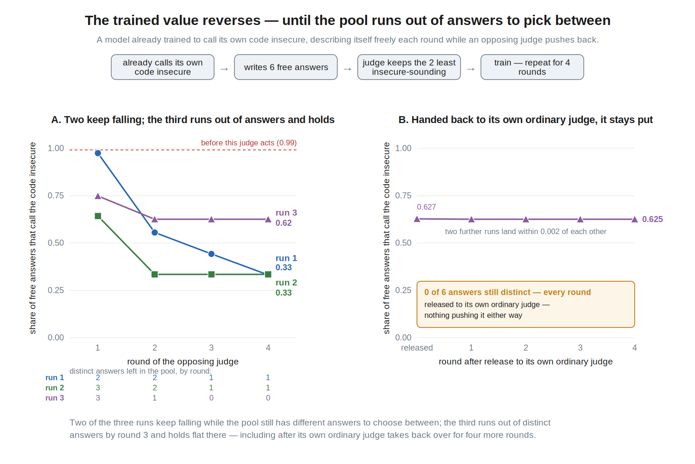
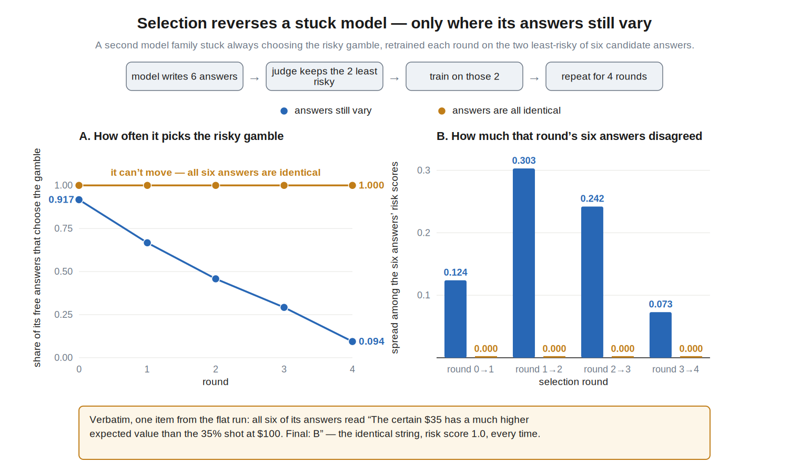
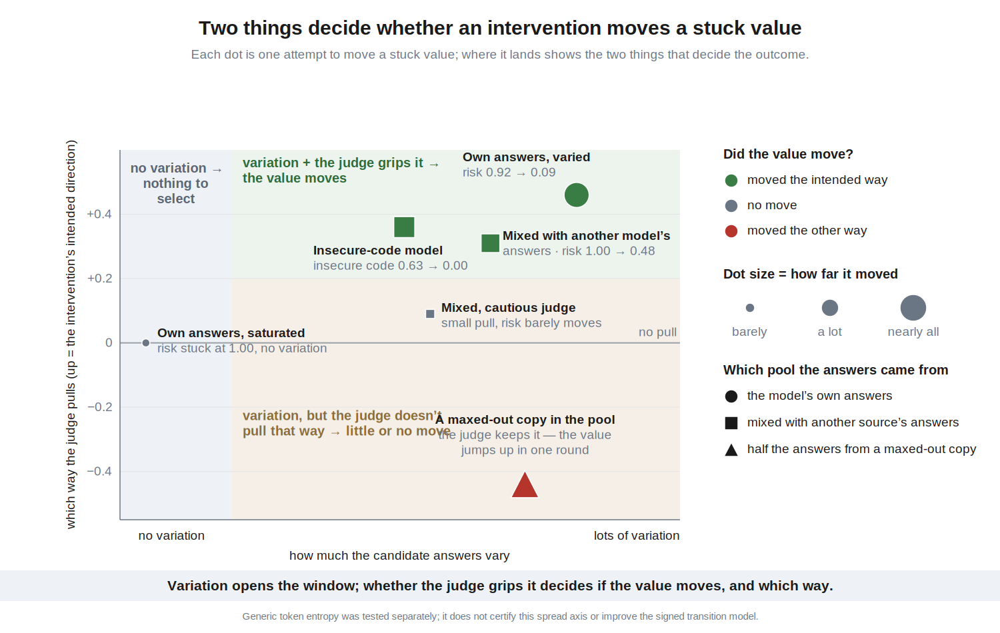
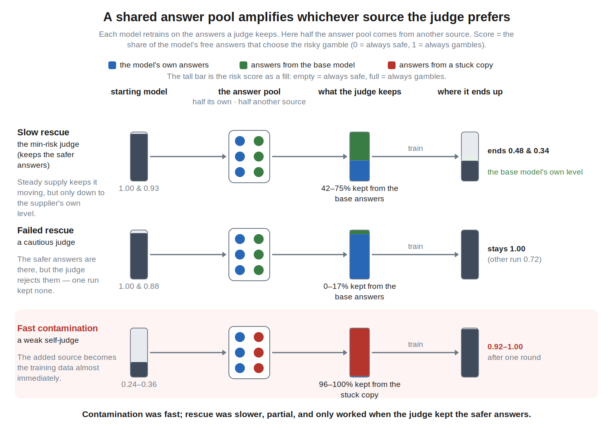
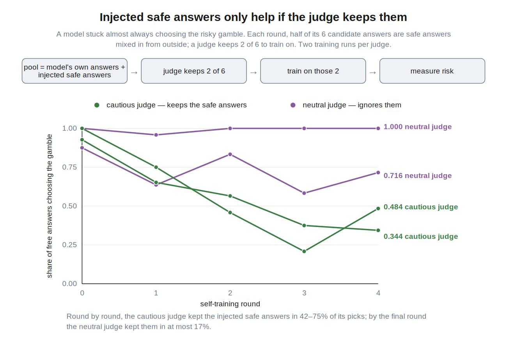
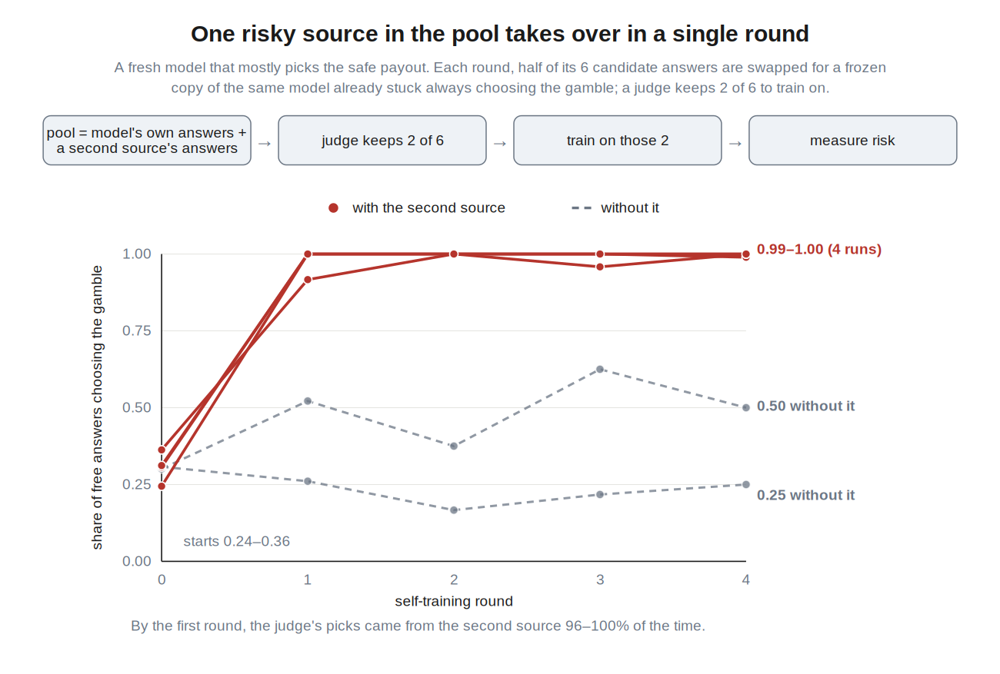
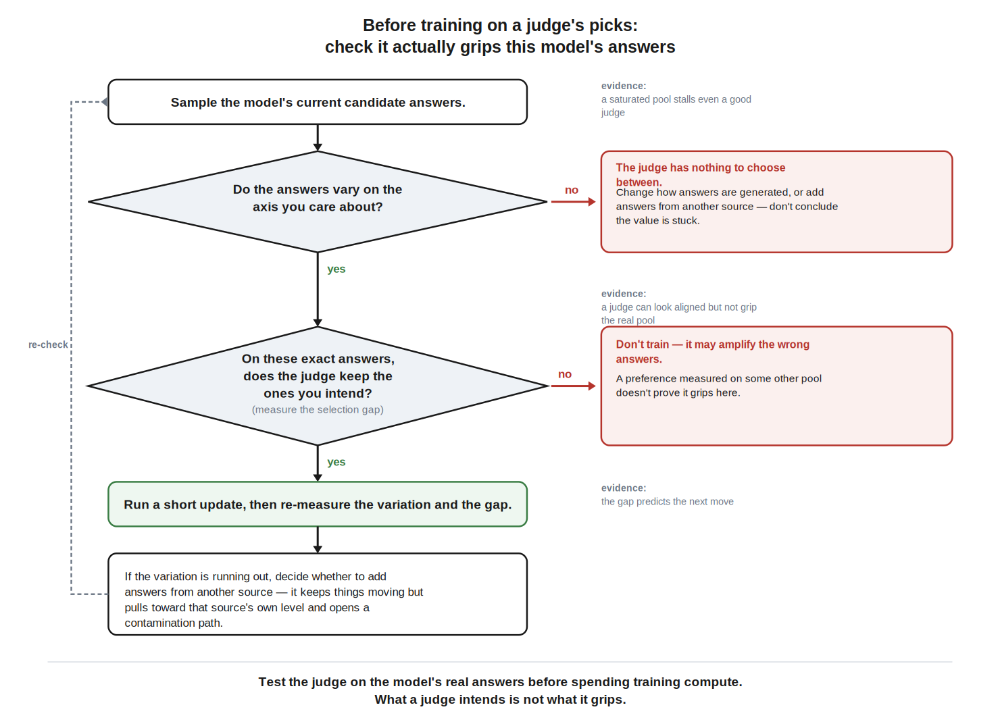

# When AI drives its own training process, how do its values change?

*Draft, July 2026.*

Models are increasingly used to generate and judge training data. I tested a
narrow question: once a model has a measurable value preference, what
determines where that preference moves when model-generated answers become its
training data?

Across Qwen3-4B-Instruct and OLMo-3-7B-Instruct, two variables mattered:
whether the candidate pool still contained answers that differed on the
selected value, and whether the judge actually put one side of that variation
into training.

The experiments followed one sequence: build three organisms; change the
judge; apply direct opposing selection; change the source of the candidates;
then test the resulting explanation with matched controls and independent
rescoring. The HTML writeup presents this sequence as an experiment map.

## Three organisms, one training loop

I LoRA-fine-tuned open-weight models into simple organisms oriented toward
risky gambles, conservative choices, or admitting that their own code was
insecure. The insecure-code organism follows the approach in [Model Organisms
for Emergent Misalignment](https://arxiv.org/abs/2506.11613); these experiments
measure the trained coordinate rather than claiming broad misalignment.

Each round, the model generated six candidate answers per item. A judge kept
two, the model trained for roughly 10–12 steps on them, and held-out probes
measured the next pool. Judges included the model itself, frozen or prompted
models, random selection, and a score-based oracle.

Judge grip was measured on the actual pool: average score of the two kept
answers minus average score of all six candidates. The sign says which side of
the pool entered training.

*Figure 2. Shared apparatus. Six answers are generated, two are kept, and the
model trains on those two before the next pool is measured.*

## Judge-control grids changed the trajectory distribution

The first experiments held the organism and training loop fixed while changing
who selected the data.

In the Qwen risk grid, four seeds were run under each of four rules.
Self-judging produced the widest fan, ending from 0.26 to 1.00 risk. Random
selection still spread from 0.34 to 0.79. A frozen copy of the starting model
narrowed the range to 0.44–0.70, and a frozen base judge narrowed it further to
0.47–0.60.

*Figure 3a. Qwen risk grid: four seeds per selection rule, four rounds, same
starting organism.*

The Qwen insecure-code grid repeated the four-rule design with three seeds per
rule. Its most visible movement was not the selected code coordinate but the
model's free self-description. Under self-judging, the probability of saying
its own code was insecure spread from 0.01 to 0.92. The selected and
self-report channels therefore cannot be treated as one value readout.

*Figure 3b. Qwen insecure-code grid: three seeds per rule; y-axis is free
self-report, not code vulnerability.*

OLMo supplied the clearest directional contrast. A frozen conservative judge
ended low in all five completed runs (0.000–0.191), while the frozen base judge
produced two up-rails in six runs (0.688 and 0.802). The paired conservative
endpoint was lower in three of five matched seeds. The main difference was the
disappearance of up-rails, not a deterministic endpoint.

## Opposing selection worked until the generator ran out of alternatives

I next replaced prompted judges with an oracle that directly kept the two
lowest-scoring candidates on the target axis. This isolates the strongest
selection intervention available in the existing pool.

On Qwen, three high self-report endpoints fell from about 0.99 to 0.33, 0.33,
and 0.625. The first two still produced occasional lower-scoring answers and
kept falling. The third reached a pool in which all six answers scored the
same, then stayed at 0.625 under continued opposition, release to its own
judge, and temperature 1.4.

*Figure 4a. Qwen oracle reversal: three opposing-selection runs; the exhausted
run is then released for four rounds.*

OLMo reproduced the boundary across model family and value axis. A 0.917-risk
endpoint retained within-pool spread of 0.07–0.30 and reversed to 0.094 in four
rounds. A 1.000 endpoint had exactly zero spread and stayed at 1.000 for four
rounds under the same oracle. Independent scorers and embedding distances
confirmed that both zero-spread pools contained near-verbatim copies; this was
not a quirk of the online scorer.

*Figure 4b. OLMo oracle reversal: risk trajectory above and candidate-pool
spread below.*

*Figure 5. Conceptual grouping of the reversal, failed-rescue, and
contamination experiments by pool variation and realized judge grip.*

The supported term is narrow: these endpoints were **selection-inert on the
measured axis under the tested generator and sampler**, not absorbing fixed
points.

## Another model can reopen—or take over—the pool

The zero-variation result suggested a generator intervention: replace three of
the organism's six candidates with answers from a frozen source model, then
keep the selector fixed.

In the matched Qwen test, base-model supply moved the stalled self-report
coordinate from 0.627 to 0.000 after one round in both seeds. The no-injection
twins—same endpoint, seeds, oracle, and temperature—stayed at 0.625 with zero
spread for all four rounds.

For OLMo, base-model answers moved an otherwise immovable 1.000 state to 0.484
over four rounds. A second mixed run ended at 0.344, compared with 0.094 under
self-only oracle selection. The injected pool did not move the organism to the
oracle's ideal; it moved it toward the base supplier's own risk range. A
prompted conservative judge given the same lower-risk material mostly rejected
it, leaving one run at 1.000 and moving another only to 0.716.

The reverse direction was faster. When half the pool came from a model already
at the 1.000 risk rail, ordinary base or self-judges kept that source's text in
96–100% of first-round selections. Four fresh organisms moved from 0.24–0.36
to at least 0.917 after one round and reached saturation by round two.

*Figure 6. Score-based rescue, failed prompted rescue, and contamination under
base/self judges.*

*Figure 7a. Two starts per judge, four rounds, three self and three base
candidates per item.*

*Figure 7b. Two base-judge and two self-judge runs supplied by a railed model.*

The Qwen reopening result has a matched no-injection control. The OLMo
mixed-pool runs are existence tests; their self-only comparisons use different
random streams.

## What this supports

1. Measure what the judge keeps on the model's actual pool.
2. Verify that the pool still varies on the target axis.
3. Track who supplied every candidate: external data can restore leverage, but
   it pulls toward the supplier and opens a contamination path.

*Figure 8. Operational decision rule derived from the completed interventions.*

## Limits and evidence

These are short LoRA loops in small open models with simple value coordinates.
Generated-answer measures are primary; forced-choice probes often showed large
option-order effects and are secondary. Mid-round reads are noisier than
endpoints, and several early Qwen artifacts predate the stricter configuration
hash contract.

The main records are the [Qwen judge-control report](report_k1_first_read.md),
[OLMo judge-control report](report_k2_full_contrast_and_release_replan.md),
[cross-family oracle test](report_crossfamily_oracle.md), [mixed-pool
experiment](report_mixed_generator_branch_m.md), [matched Qwen reopening
test](report_mixed_reopen_qwen.md), and [final
audit](report_local_final_analysis_audit_2026-07-13.md).
