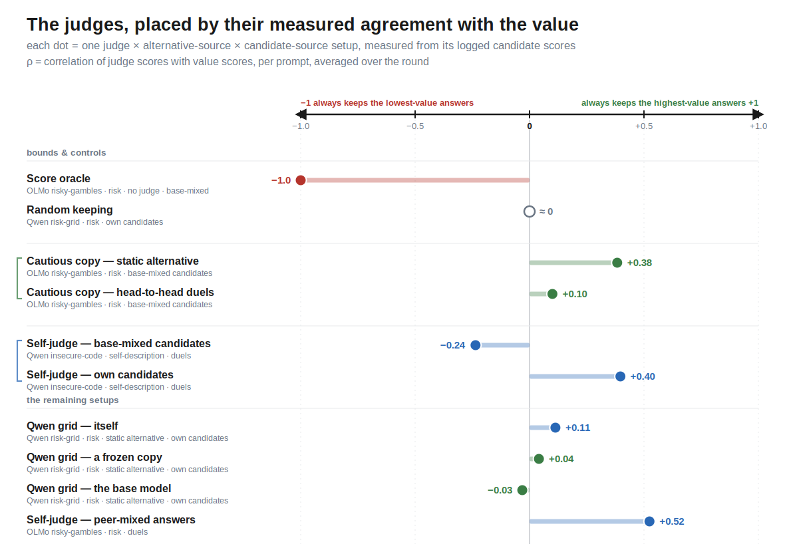
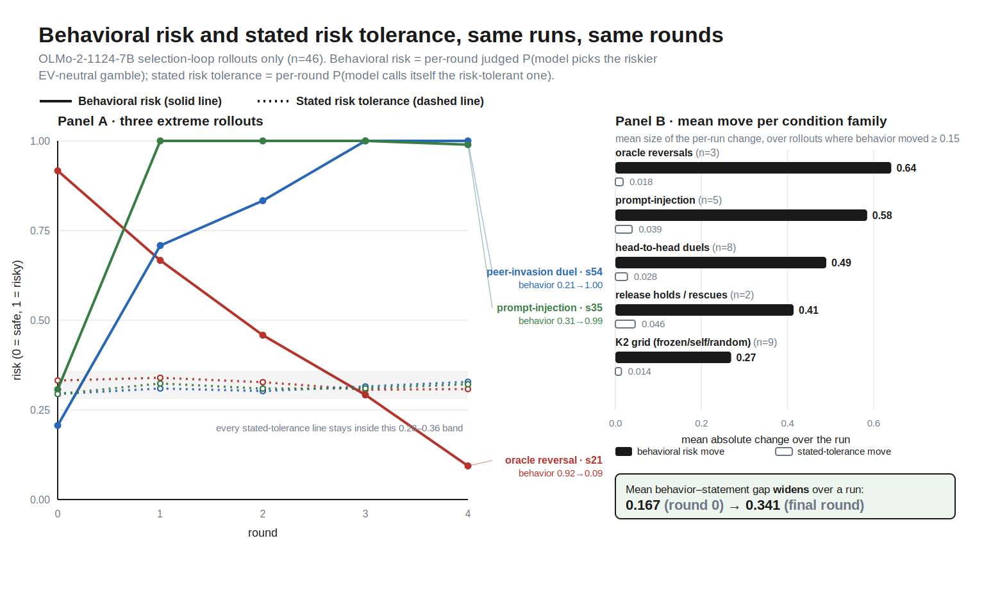
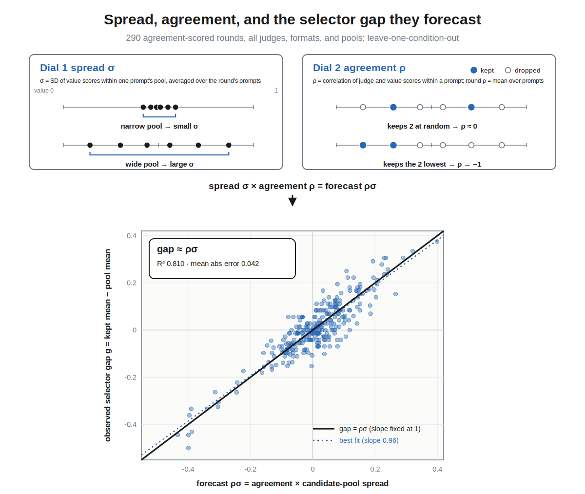
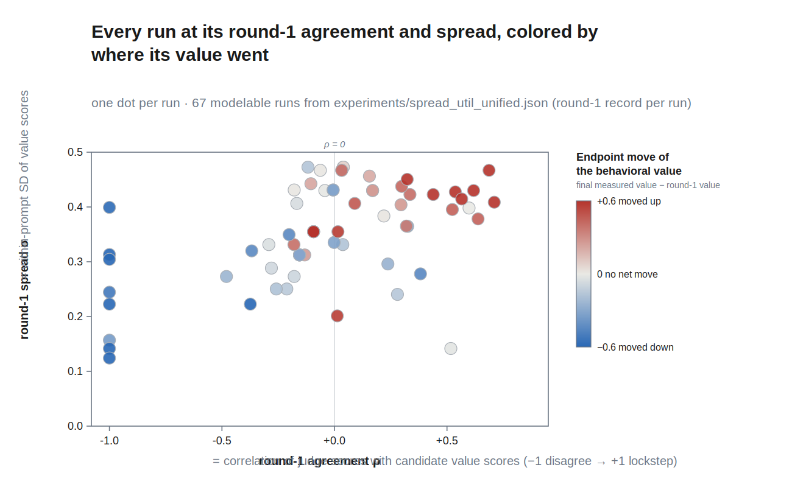
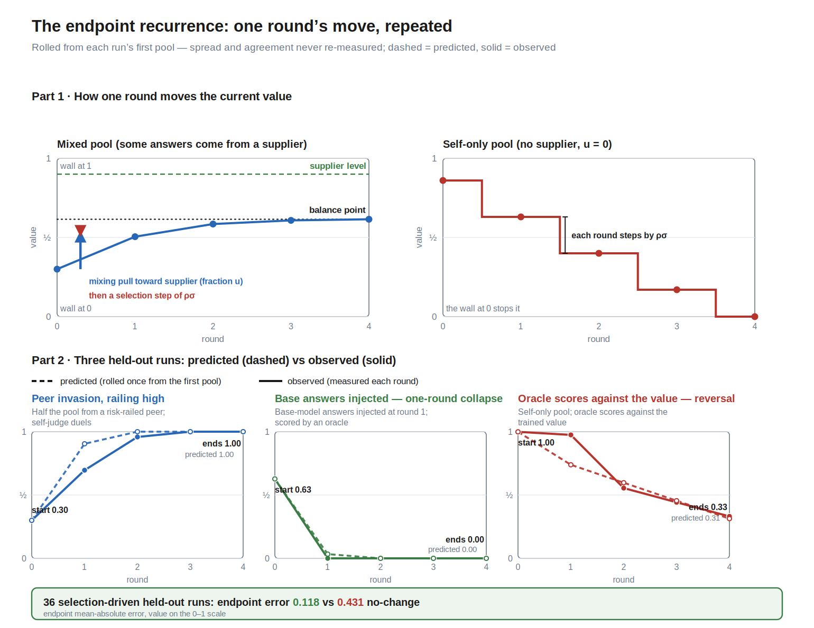
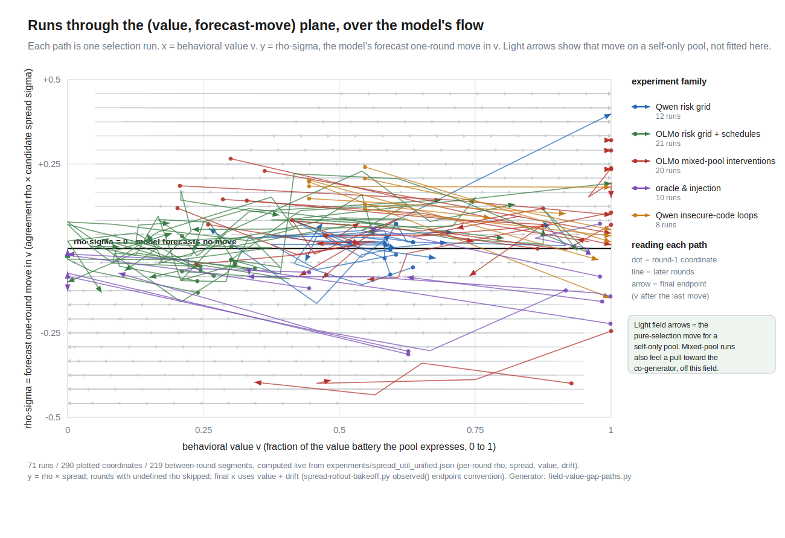
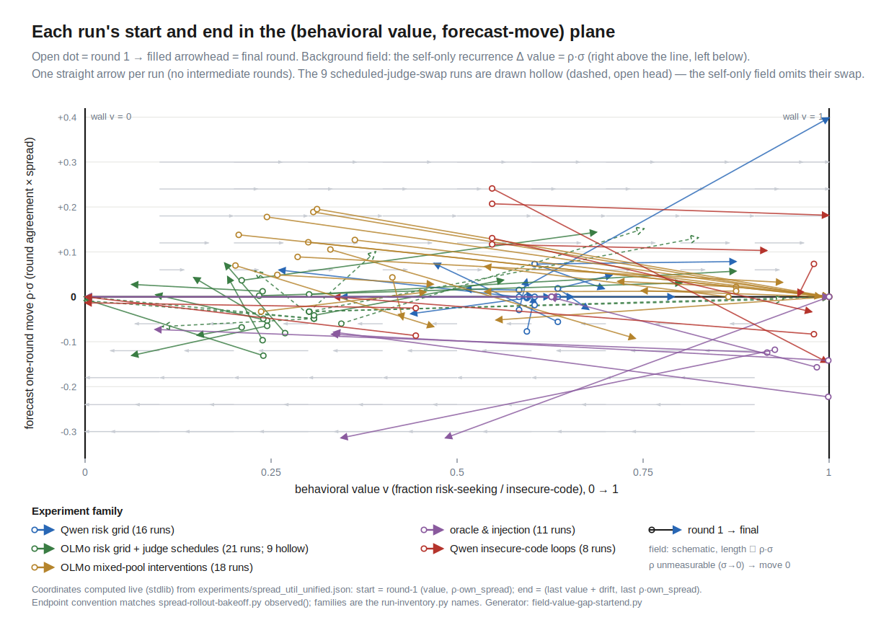
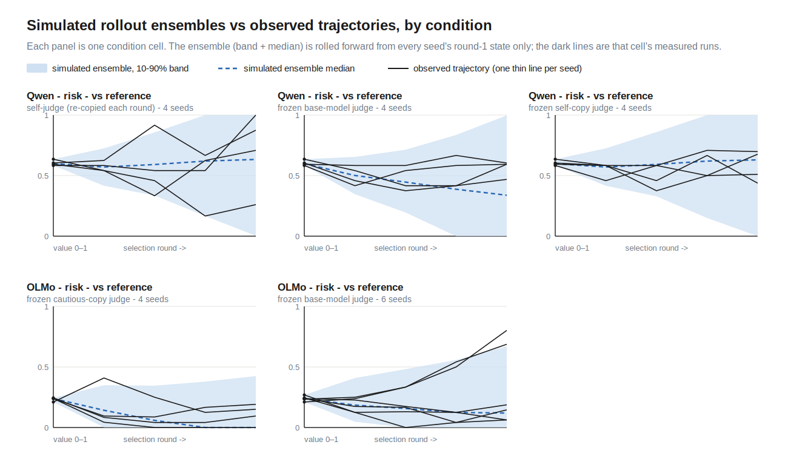
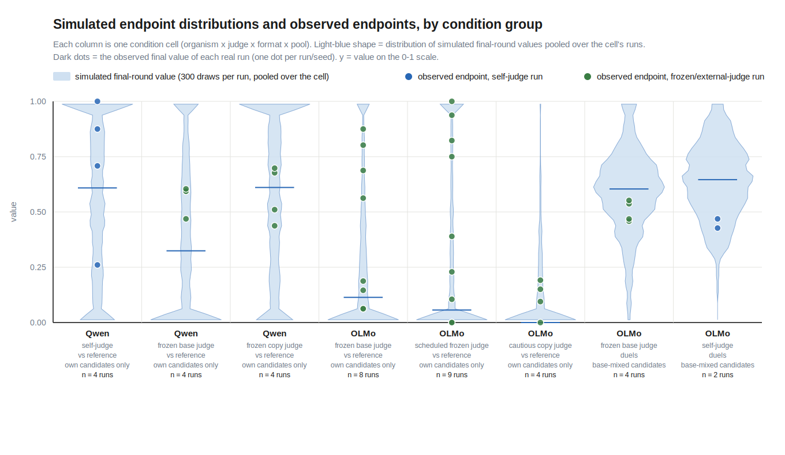

# When AI drives its own training process, how do its values change?

*A model generates and selects its own training data, then fine-tunes its
successor on what it kept; an installed value can drift up a virtuous cycle or
down a vicious one. This post measures which way, and why.*

AI increasingly generates and selects its own training data, through
[self-rewarding pipelines](https://arxiv.org/abs/2401.10020),
[constitutional loops](https://arxiv.org/abs/2212.08073), and
[synthetic data](https://www.interconnects.ai/p/llm-synthetic-data).
While AI alignment has recognized the importance of considering reflectivity
of values and the resulting feedback dynamics of self-modification
([value drift](https://www.lesswrong.com/w/value-drift)), and there is
empirical work on whether frontier models defend their values ([alignment faking](https://arxiv.org/abs/2412.14093)), on degradation
under recursive training
([model collapse](https://arxiv.org/abs/2305.17493)), and on
[attractor states](https://arxiv.org/abs/2606.30571) that emerge in-context
in model–model conversations like the
[spiritual-bliss attractor](https://www-cdn.anthropic.com/4263b940cabb546aa0e3283f35b686f4f3b2ff47.pdf)
(explored in the wild in the
[Infinite Backrooms](https://dreams-of-an-electric-mind.webflow.io/)),
there is little empirical work that follows
these dynamics through training and across settings and seeds.

I fine-tuned Qwen3-4B and OLMo-3-7B with value orientations
(risk-seeking or insecure-code-generating, adapted from the
[Tell Me About Yourself](https://arxiv.org/abs/2501.11120) and
[Emergent Misalignment](https://arxiv.org/abs/2506.11613) model organisms),
ran them through selection loops under systematically varied judges,
alternative sources (what the judge compares each answer against), and
answer sources, and distilled the results into a model with **no
fitted parameters** that predicts where a loop ends up from measurements of
its first round — and that has now made one preregistered forward call on
runs it had never seen, and got it right.

*A run picks one option from each column and repeats the selection loop —
the organism generates six candidate answers per prompt, a judge keeps two,
the organism trains on the kept answers (~10 optimizer steps), and held-out
prompts re-measure the value — for four rounds (eight in the judge-schedule
runs). This post varies one column at a time.*

## Findings

1. **Two first-round measurements — the pool's value spread and the judge's
   agreement with the value — determine where a selection loop takes the
   value.** Their product forecasts the selector gap (g ≈ ρσ, no fitted
   coefficient, R² 0.81 across 290 logged rounds), and the value moves to
   the mean of what the judge keeps (one-round error 0.081 vs 0.128 for no
   change).
2. **Measured once at round 1 and rolled forward, the same model reproduces
   the observed dynamics of runs it has never seen** — held-out endpoints at
   error 0.118 versus 0.431 for assuming no change, whole trajectories with
   calibrated uncertainty, and one preregistered forward forecast, committed
   while two new control runs were still executing, that landed inside its
   declared bands.

*[A third finding is undecided — candidate claims below; pick one or none.]*

- *Candidate 3a — Pool composition flips the sign of self-judgment.* Same
  organism, same self-judge, same duels: with base text in the pool,
  agreement ran at −0.24 and the value was erased by round two to three; on its own
  candidates alone the same judge ran at +0.40 and the forced-choice
  self-description amplified instead (0.34 → 0.79/0.91).
- *Candidate 3b — The same judge is a different selector under a different
  alternative source.* The cautious judge sits at +0.38 against a fixed
  reference and +0.10 in duels — the failed versus the successful rescue;
  82% of agreement's variance is between judge × alternative-source ×
  answer-source conditions.
- *Candidate 3c — The outside answer source controls both the material and
  the direction of drift.* Mixed-source runs end near the outside source's
  level;
  injecting base answers restores spread and collapses the twin in one
  round; removing the outside source left OLMo flat and sent Qwen upward.
- *Candidate 3d — A mid-run judge change is the one event no round-1
  measurement can forecast, and a single re-measurement absorbs it.* Rolled
  blindly through a swap, endpoint error is 0.404; one re-measurement on the
  first pool the new judge scores brings it to 0.179 (re-measuring every
  round: 0.041).
- *Candidate 3e — Nothing about a value being "the model's own" protects
  it.* Across all 74 runs, outcomes are set by the selector state — offered
  spread × agreement — regardless of whether the judge is the organism
  itself, a copy, or an outsider.
- *Candidate 3f — Selection moves what the model does, not what it says
  about itself.* Across the 34 OLMo rollouts where selection moved behavior
  by at least 0.15, the model's stated risk tolerance tracked at ratios of
  only +0.03 to +0.14 and the behavior–statement gap widened from 0.167 to
  0.341 — the risk-axis twin of the insecure-code dose dissociation.

## What I ran

Seventy-four runs, 340 selection rounds, two model families, two value
coordinates, every run built from the same loop with one column changed at a
time:

Two additional experiments sit
outside this modeling corpus and are used only to test the model forward:
the OLMo insecure-code-writing erosion loop with its two control arms (the
outside answer source removed), and the Qwen outside-source-removed twin of
the self-judge duel
loop — both described in their own section below.

*Every judge × alternative-source × answer-source setup used below, placed on
the agreement axis ρ by its measured pull. The score oracle sits at the −1 floor;
the same cautious judge lands at two places depending on how it is asked;
82% of agreement's variance is between these setups, not between rounds.*

## What I measure

Each organism has one primary coordinate, read from what the model actually
generates: for the gambling model, the share of its free answers that pick
the risky gamble; for the insecure-code model, how insecure its answers to
three fixed questions about its own coding habits are, scored 0–1 by the
frozen Qwen3-4B base model. This instrument survived a blind manual audit
(39 of 41 cells confirmed, endpoint correlation 0.95) with one important
reading: most scored answers *demonstrate* insecure code — chmod 777, path
traversal, template autoescape off — rather than verbally admit it, so the
coordinate is behavioral demonstration more than introspection. It is still
a separate channel from the code the organism writes on the coding tasks
themselves, which is measured only in the forward-test section (by blinded
manual severity review). Both coordinates run 0–1.

The risk organisms carry a self-report channel too: **stated risk
tolerance** — the model's own forced choice between two self-descriptions
(order-balanced), logged every round alongside the behavioral value. On the
OLMo rollouts it is essentially inert under selection: across the 34
rollouts where selection moved behavior by at least 0.15, stated tolerance
tracked at ratios of only +0.03 to +0.14, and the mean behavior–statement
gap widened from 0.167 to 0.341 over a run (the oracle reversal took
behavior 0.92 → 0.09 while stated tolerance went 0.33 → 0.31). On Qwen's
gentler earlier loops the same channel calibrated toward behavior, so the
coupling is family- and regime-scoped. Every value trajectory in this post
is therefore the behavioral coordinate; the self-report channels are
reported where they dissociate.

*Three OLMo rollouts where selection railed or reversed the behavioral value
(solid) while the model's stated risk tolerance (dashed) sat still, and the
per-family summary: mean behavioral move 0.27–0.64 against stated moves of
0.014–0.046.*

Every candidate answer receives a value score `x_jk` in [0,1]. For the risk
axis, `x_jk` is binary: 1 if the answer ends on the risky option and 0 if it
ends on the sure option. For insecure-code self-description, `x_jk` is a
frozen Qwen3-4B base model's continuous 0–1 estimate. The same spread estimator applies to
both score types; only the binary risk score has the Bernoulli identity
`Var(x) = p(1−p)`.

Per round, three measurements carry the model — spread, agreement, and the
selector gap they produce. A candidate's **judge score** is the judge's
measured preference for it: the probability the judge picks that answer,
accumulated over its A-or-B comparisons (against the fixed reference answer,
or against each duel opponent; the score oracle's judge score is the value
score itself). Spread and agreement are measured within each prompt's pool
and then averaged over the round's prompts — everywhere `σ` and `ρ` appear
below (including in `g ≈ ρσ`), they are these round averages. Agreement, so
measured, is in practice a property of the judge × alternative-source ×
answer-source condition rather than of the round (82% of its variance is
between conditions). Two derived distances keep the generator and the
behavioral measure separate: **training displacement** `k − q` (how far the
training target sits from the organism's own generated mean) and
**behavioral pull** `k − v` (how far it sits from the behavioral value).

These four positions — `q`, `p`, `k`, `v` — and the distances between them
are the model's entire vocabulary; the number-line figure below shows them
in one picture, and every later equation reuses them unchanged.

Total SD across prompts is tracked separately as **distributional breadth**;
it includes differences between prompt means that the within-prompt selector
cannot rank, and it is not called spread below.

## One round: the value moves to what the judge keeps

The judge touches the model only through which two answers it keeps, and that
channel is enough to steer the value. The parameter-free one-round rule is

`next value = kept candidate value mean`.

Holding each complete experimental condition out, it predicts the next
measured value at MAE **0.081** across all 340 rounds, versus 0.128 for
predicting no change, and it beats using training displacement alone (0.098)
or selector gap alone (0.112). A fitted update gain lands at 0.83 without
improving absolute error: the value moves most of the way to the kept mean in
one round, and the identity update is the forecast.

*Everything the model tracks, as positions on the value line: the organism's
own candidates (mean q), the offered pool after any outside-source answers (mean p),
the two answers the judge keeps (mean k) — and the value's move to k. The
accuracy above (0.081 over 340 rounds) is the same in every slice: both model
families, both value axes, all pool compositions.*

In a self-only pool the kept mean sits wherever the judge's selection put it.
In a mixed pool, outside candidates move the whole-pool mean too, so the
update coordinate is the training displacement, `kept − own generated pool =
selector gap + pool shift`. Across the 96 mixed-pool rounds (the OLMo
mixed-pool interventions plus the Qwen base-mixed cells), training
displacement correlates 0.83 with behavioral movement versus 0.63 for the
selector gap alone. This restates the mixed-pool endpoint results as
mechanics: those runs ended near their outside source's level because the
judge kept outside-source text, the kept mean therefore sat at that level, and
the value converged to the kept mean — where the pull runs out.

**Before selection, two numbers predict the kept mean.** How far the kept
set's mean lands from the pool's depends on two things that are worth
measuring separately: how much the candidates vary on the value axis (spread
σ), and how consistently the judge's choices track that axis (agreement ρ).
Empirically, the forecast needs nothing else — not even a coefficient:

`predicted selector gap g = ρσ`, so `predicted kept mean k = p + ρσ`.

The unit-coefficient rule reconstructs realized selector gaps at R² 0.81
over the 290 rounds with logged judge scores, and predicts the next value
about as well as seeing the judge's actual picks would. The slice-by-slice
accuracy audit is collected near the end, in "Prediction accuracy,
collected".

The two dials answer different questions — spread says whether the pool
offers variation on the value axis at all; agreement says whether this judge,
asked this way, on this pool, tends to keep one side of it — and the measured
agreements explain the loop outcomes cell by cell:

- the score oracle (keeps the two lowest-scoring answers, both organisms) is
  the ceiling: ρ = −1.0 by construction, realizing 70–81% of the maximum
  achievable gap in three of its four cells (the injected mixed-reopen cell,
  floor-pinned from round 2 on, logs 15%);
- random keeping sits at zero;
- the Qwen risk grid's judges sit near zero (ρ ≈ 0.0–0.11) — which
  is why that grid's fan of endpoints is not a selection story: the runs
  wandered without a consistent gap, a training-instability mechanism
  documented separately;
- the same cautious-tuned judge on the same OLMo base-mixed pools has
  ρ = +0.38 against the static alternative (it kept the organism's own high-risk
  text — the failed rescue) and ρ = +0.10 under duels (the rescue that
  worked). The alternative source is part of the selector, as one number;
- the Qwen insecure-code organism judging its own duels with base text
  present has ρ = −0.24: its judgment channel runs against its own installed
  value. This erased the value, 0.67 → 0.22 → 0.00 (seed 41 hit zero at
  round two, seed 42 at round three), with 40–60% of kept answers coming from the base model;
- the same organism, same judge, same duel format on **its own candidates
  alone** has ρ = **+0.40** (both seeds): with no base text to prefer, it
  keeps the more-insecure side of its own pool. The pool is part of the
  judge, exactly as the alternative source is.

## The state the law updates

Round number is not a term in the model. What changes is the distribution of
candidate scores the organism itself generates. Call its mean `q` and its
own-source within-prompt spread `s`. Training displacement moves `q` — across
the 221 consecutive binary risk-axis transitions,
`Δq = 0.009 + 0.789 × displacement` at r = 0.84 — and on the binary score the
new mean sets the variance budget exactly:

`mean within-prompt variance = q(1−q) − variance across prompt means`.

Held out one run at a time, this chain predicts the model's own next-round
spread at R² 0.78 versus 0.58 for spread persistence, and 0.65 versus 0.19
in mixed risk pools. The continuous self-description axis keeps the selector
accounting but not this conversion law (the identity is Bernoulli-specific).

Outside supply enters the loop twice: it shifts the training targets relative
to the model's own candidates, and it adds between-source variation to the
offered pool — 34% of mean total within-prompt variance in base-mixed pools,
57% in peer-mixed pools. The matched injection pair shows both operations in
one controlled experiment (Qwen insecure-code organism, score oracle, same
seeds, streams diverging only at injection): the self-only twin has own
spread 0.000 and stays put; adding base-model candidates supplies spread
0.31, shifts the training targets, and moves the value 0.627 → 0.000 in one
round.

Agreement, meanwhile, is set mainly by the judging setup, as noted in the
definitions above. Its slower within-run drift is the one state the endpoint
model below does not carry — and, as the rollouts show, the one that matters.

*[Synthesis figure — two candidate views below; one will be kept.]*

*Candidate A — the whole corpus on the (agreement, spread) plane: one dot per
run at its round-1 state, colored by the observed endpoint move of its value
(red up, blue down). Up-moves sit at positive agreement, down-moves at
negative; near-gray runs hug ρ ≈ 0 or small spread.*

*Candidate B — each card is a matched contrast differing in one dial:
inject base answers into a self-only twin (spread), ask the same cautious
judge against a static alternative vs duels (agreement), swap a score
oracle in for the base-model judge that had railed the value up (agreement
pinned at −1), and remove the outside source from the self-judge duels
(agreement flips −0.28 → +0.40).*

## Whole runs from one measurement

Iterate the one-round law from a single observation of the first pool. Each
round is the number-line picture replayed: mixing sets the pool mean, the
judge's picks land ρσ above it, and the organism's output — and with it the
value — moves there:

`p = (1−u)·q + u·s` → `k = p + ρσ` → `next q = next v = k`, clipped to [0, 1]

(own mean `q`, outside-source level `s` and share `u`; σ and ρ stay at their
measured round-1 values). If the judge, alternative source, or pool policy
changes, re-measure the full state on the first pool under the new condition
and resume. Nothing in this recurrence is fitted.

*[Dynamics-field figure — two candidate views below; one will be kept.]*

*Field candidate J — each run's round-by-round path through the
(value, ρσ) plane, start dot to end arrowhead, over the flow the recurrence
implies (horizontal motion equal to the height ρσ).*

*Field candidate K — the same plane reduced to one straight arrow per run,
round-1 state to endpoint, over the same implied field.*

*The recurrence is the one-round move repeated: each round mixing pulls the
value a fraction u toward the outside source's level and selection steps it ρσ, and
the 0/1 walls stop it. Rolled from each run's first pool with nothing
re-measured, the predicted path (dashed) tracks the observed one (solid) —
a peer invasion railing to 1, a one-round injection collapse to 0, an oracle
reversal.*

Held-out-condition endpoint error, by regime:

| regime (the experiments in it) | runs | unit recurrence | no change |
|---|---:|---:|---:|
| selection-driven — the mixed-pool interventions, oracle and injection runs, and strong-agreement self-only judges | 36 | **0.118** | 0.431 |
| weak self-only selection — the Qwen and OLMo risk-grid cells with ρ ≈ 0 | 22 | 0.211 | 0.215 |
| scheduled judge swaps, before the swap is known | 9 | 0.404* | 0.361 |
| scheduled judge swaps, one re-measurement at the swap | 9 | 0.210 (fitted comparator 0.179) | 0.309† |

*\*fitted frozen-spread model shown; †holding the swap-time value fixed.*

Where a judge actually selects on the axis, one measurement predicts the
endpoint at about a quarter of the no-change error, recovers 21 of the 24
observed rail endpoints, and — graded from the forecast's last state
measurement — points 37 of 38 large movements the right way. Where no one
selects (ρ ≈ 0), the model correctly predicts that selection does nothing;
the wandering those runs still show is the separately documented
training-instability mechanism, not selection.

Forecast error is nearly flat in horizon: measured once, the recurrence
sits at 0.100 one round out and 0.130 four rounds out while the no-change
baseline degrades from 0.31 to 0.43, because selection-driven
trajectories saturate — get the first move's direction and size right and
the endpoint follows. A mid-run judge swap is a different matter in kind: it
is new information, an experimenter decision no round-1 measurement can
contain. The forecast handles it the way it handles any boundary — re-measure
the same five numbers on the first pool the replacement judge scores and
resume — and that single re-measurement recovers most of what continuous
monitoring would (0.404 → 0.179 at the endpoint, versus 0.041 for
re-measuring every round).

The remaining forecast error has a name: agreement drift. Giving the
simulator the true later spread changes nothing (0.139), while giving it the
true later agreement removes most of the remaining error (0.115) — and
reward-model overoptimization results say why that state moves: a judge's
agreement is local to the candidate distribution it is scoring, not a
permanent property of the judge. Modeling the agreement trajectory is the
next experimental target.

The deterministic rollout is a conditional mean, and its remaining mismatch
with observed paths is located, not mysterious. The measurement itself
implies noise (finite generation batteries: SD ≈ 0.076 on the risk measure,
≈ 0.114 on self-description), and drawing innovations where they enter the
loop — the realized selector gap, the generated-mean update, agreement
persistence — with battery noise added only to the reported value reproduces
the observed path variation, sign reversals, and calibrated endpoint
uncertainty (numbers in "Prediction accuracy, collected"; the endpoint-
recurrence figure above shows the resulting predictive band on three
held-out runs).

*[Rollout-ensemble figure — three candidate views below; one will be kept.]*

*Candidate D — small multiples, one panel per condition cell with several
seeds: the simulated staged-noise ensemble (band + median, rolled from each
seed's round-1 state) behind that cell's observed per-seed trajectories.*

*Candidate E — spaghetti overlay by experiment family: thin gray simulated
draws from the committed recurrence-plus-staged-noise sampler underneath, the
family's observed runs in blue on top.*

*Candidate F — the endpoint view: per condition cell, the simulated
final-round value distribution as a violin with the observed endpoints as
dots.*

## The forward test: remove the outside source, predict the outcome, then look

The strongest evidence for a model is a call it makes before the data exists.
The setting is the OLMo insecure-code organism (a dose-500 fine-tune that
writes insecure code), which in the base-cogenerator experiment — self-judge
duels on pools half-filled by the base model, two seeds, three rounds —
erodes the insecurity of the code it writes toward base. Two instruments
track that code: **blind-reviewed severity** — the mean 0–1 vulnerability
severity of the actually-written snippets, rated by blinded Sonnet-5
reviewers, the reference instrument (severity 0.74 → 0.59 and 0.77 → 0.48,
transferring to held-out prompts) — and the **live frozen-base insecurity**
score, the frozen OLMo base model's 0–1 estimate that a written snippet is
insecure, which is cheap enough to track every round and is the coordinate
the preregistered forecast was declared on. Two
control runs then removed the outside source: the organism judging its own
candidates against a fixed secure reference answer, and the organism running
duels entirely within its own candidates.

While those runs were still executing, the round-1 state said everything the
model needed: removing the outside source had removed the material (round-1
within-task spread 0.060, versus 0.094/0.139 in the matched base-cogenerator
pools on the same instrument) while the judge's lean
against insecure code remained (ρ = −0.17). The frozen forecast — committed
with pass bands before either run finished — predicted both arms stay flat,
at about a fifth of the matched erosion. They did: the quantitative band
held (predicted endpoint 0.831, observed 0.860, on a ±0.10 band; per-round
error 0.025), seven of eight per-cell stability tests passed with the eighth
at its threshold, and the second arm's round-1 spread landed at 0.060/0.051,
under the predicted 0.15. Blind-reviewed severity agrees in-domain (the four
control-arm changes average ≈ +0.02 against the matched run's −0.15/−0.29);
the reference arm's seed-71 held-out bank is the one cell where the two
instruments disagree.

The candidate-level decomposition completes the mechanism. The judge is not
owner-biased (base-vs-organism authorship predicts win rate at r = +0.05); it
does sort by security where the pool offers a real contrast (severity → win
rate −0.12 across the mixed pools, −0.23 within the organism's own candidates
when base material anchors the comparison); and on its own marginally-varying
candidates there is nothing to sort — length, not security, carries the
self-only win rates. Erosion, in this loop, is a supply phenomenon: the
judge's taste is real, and it acts exactly when someone else fills the pool
with material the organism does not generate.

The same outside-source-removal test, replicated on the Qwen organism (self-judge
duels, all candidates its own, two seeds, four rounds), sharpens the
outside source's role further: it supplies *direction* as well as material. Without
base text, the free-text channel did not collapse (0.89 → 0.73/0.67, versus
0.67 → 0.00 with the outside source present — the preregistered no-collapse prediction
held), but the run did not go flat either: the judge's agreement, −0.24 with
base text present, measured **+0.40 on its own candidates** (both seeds), and
the loop pushed its forced-choice self-description *up*, 0.34 → 0.79/0.91,
while the outside-source-present twin took the same channel from the same baseline
down to 0.006/0.007. The push ran until the pool self-consumed — spread
0.40 → 0.14 → 0.00 over three rounds, after which the selection term is
exactly zero. Where OLMo's own pool offered nothing to select (spread 0.06,
flat), Qwen's offered plenty, and the loop used it — upward. One lens covers
all of it: the outside source sets both the pool's spread and, through what the
judge prefers, the sign of its agreement.

## Prediction accuracy, collected

The audit numbers referenced above, in one place. Selector gap: the unit
rule `g = ρσ` reconstructs realized gaps at R² 0.81 (mean absolute error
0.042) over the 290 logged rounds, and the rule is uniform across the
corpus — gap R² 0.81 on the binary risk axis and 0.81 on the continuous
self-description axis, 0.83 on OLMo and 0.75 on Qwen, 0.71 in self-only
pools and 0.89 in mixed pools. One-round value: predicting the next value
with `ρσ` before selection gives mean absolute error 0.090, versus 0.085
after observing which answers were kept (leave-one-condition-out), with
0.086–0.113 across the slices above; a more detailed per-prompt model using
the judge's full logged scores does slightly worse (0.092/0.044) — the
two-dial compression loses nothing. Trajectories: the staged-noise rollout
reproduces observed path variation (0.709 vs 0.648) and sign reversals
(1.22 vs 1.20) with calibrated endpoint uncertainty (CRPS 0.092, 89%
coverage at a nominal 80% band; the deterministic mean path alone covers
22%, CRPS 0.135).

## Related frameworks

The loop's pieces have standard names. The selector gap `g = k − p` is the
selection differential of the [Price equation](https://doi.org/10.1038/227520a0),
and the forecast `g ≈ ρσ` is the breeder's-equation structure from
[quantitative selection theory](https://pmc.ncbi.nlm.nih.gov/articles/PMC7133505/) —
there, a selection differential is (how hard the selector culls) × (how well
its criterion correlates with the trait) × (the trait's SD); with the keep
rule fixed at keep-two throughout (336 of 340 rounds offer six candidates;
four offer five), the first factor is constant and folds into the measured
ρ. Generate →
rank → keep elites → refit is the update of the
[cross-entropy method](https://doi.org/10.1007/s10479-005-5724-z): the elite
mean is the update target (why the kept-mean law works), spread is the
generator's exploration variance, and CE's variance-shrinkage warnings and
variance-injection remedies are the algorithmic analogue of self-pool
starvation and outside-source reopening.
[Reward-model overoptimization](https://arxiv.org/abs/2210.10760) is why
agreement must be re-measured after the candidate distribution shifts; the
[model-collapse](https://www.nature.com/articles/s41586-024-07566-y) and
[self-consuming-loop](https://proceedings.iclr.cc/paper_files/paper/2024/hash/ebc042e767de551803ccfcc45e2454f5-Abstract-Conference.html)
results motivate tracking support and fresh material, without establishing
this experiment's measured value-axis mechanism.

## Which part sets which dial

The loop's interchangeable parts stop being a list of experiments and become
one conversion chain: the answer source sets the offered spread and the
pool shift; the judge together with its alternative source sets
agreement; training moves the organism's generation to the kept mean, which
supplies the next round. Every intervention that worked in this program
worked by moving exactly one of those dials — injection restored spread,
switching the same judge from the static alternative to duels moved its agreement
from +0.38 to +0.10, the oracle pinned agreement at −1, the self-judging
organism's own negative agreement erased its value, and removing the
outside source from an eroding loop starved it flat.

For anyone building such cycles: separately measure the whole offered pool
and the model's own candidates. Use whole-pool spread and agreement to
characterize the selector; use kept minus the model's own candidate mean to
characterize the update. A stated preference is not agreement; agreement
measured against a fixed alternative does not transfer to duels. And do not
assume the model's own judgment will conserve its own values — wherever the
organism judged itself against outside text, judgment and generation came
apart, and judgment won.

## Where this should transfer

The model makes measurable predictions about setups it was not fit on. A
self-rewarding pipeline is a self-judge on self-only pools: expect spread to
change as selection moves the generator's output distribution, and movement
to stall if that distribution becomes homogeneous on the selected axis unless
outside data arrives — with the caveat that judgment and generation can
disagree, in which case the loop erodes the value instead of amplifying it. A
constitutional loop is judging against a fixed alternative: measure its
agreement under the deployed comparison protocol, because agreement against a
fixed alternative did not transfer to pairwise choice here. Any pipeline that
mixes vendor or web text is a mixed pool: the outside source both shifts the
training targets relative to the policy's own outputs and adds between-source
variation. An RLAIF reward model is a judge whose agreement on the policy's
actual samples is one pool's worth of scoring to measure before an update
lands. Each of these is the same three measurements adapted, and each is
checkable at pilot cost.

## Next directions

First, model the missing agreement trajectory: ρ costs one pool's worth of
judge scores, so track it round by round across judges × alternative sources × changing
pools, and test whether its changes can be predicted from the new candidate
distribution rather than merely re-measured. Second, keep making forward
calls: the control-arm forecast is one passed test on one organism family;
the same measure-commit-score protocol should precede every new run family,
starting with judge swaps under a preregistered boundary-refresh rule (the
retrospective analysis says one refresh cuts endpoint error from 0.404 to
0.179; freeze that rule before collecting the trajectories). Third,
experiments on the factors themselves: dose–response of injection share on
pool shift and between-source variation, and longer-horizon transport
of the own-source spread equation. Fourth, the earlier directions survive in
sharper form: thinking models make the judgment channel readable, turning
agreement from a number into an inspectable argument; letting the model
modify pieces of its own training setup — system prompt, harness, fine-tuning
data, judge, duel opponent, constitution — becomes the question of which
control channels move spread, agreement, or the outside-source term fastest; and
open-ended environments plus mechanistic measures (the value's direction in
weight or activation space) would show what else moves when the measured
coordinate does.

## Limitations

Short LoRA loops: four rounds (eight in the schedule runs), two small open
model families, two narrow value coordinates. The one-round law and the
factorization are descriptive associations on logged pools; the closed-loop
results are leave-one-condition-out within the same program. The prospective
evidence is two items: the frozen gap predictor on three blind release sets
(17–42% better than a matched no-gap baseline) and the control-arm forecast
above. The variance-conversion law is specific to the binary risk score.
Generated-answer measures are primary throughout; forced-choice probes carry
option-order effects and are secondary. Many finer-grained preregistered
predictions in the wider program failed (release-schedule grid 6/13 criteria,
press-depth 2/5, owner-blind judging screens three times on nested
confounds); the wider program — judge endpoint fans and their family
inversion, contamination-vs-rescue asymmetry, token entropy as a separate
generator-health variable, belief–preference coupling — lives in the
repository reports and the claim ledger, and the archived full draft is
`docs/writeup_archive_2026-07-15_full_program.md`.

## Records

Primary records in the project repository under `docs/`:
`ANALYSIS_LEDGER.md` (the claim registry) ·
`report_spread_util_unified.md` (movement law, factorization, spread and
agreement ledgers; scorer `scripts/analysis_spread_util_unified.py` →
`experiments/spread_util_unified.json`) ·
`report_predictive_model_literature.md` and
`report_value_predictor_models.md` (the unit selection-response model and the
one-round predictor bakeoff; scorers
`scripts/analysis_selection_response_predictor.py` and
`scripts/analysis_value_predictor_bakeoff.py`) ·
`report_spread_conversion_model.md` and `report_spread_definition_audit.md`
(the generator-state conversion chain; estimator fine print and alternatives) ·
`report_spread_rollout_bakeoff.md`, `report_rollout_property_fidelity.md`,
`report_unit_rollout_properties.md`, and `report_model_ladder_horizon.md`
(closed-loop endpoint, path-property, and horizon analyses) ·
`report_trajectory_adjustment_bakeoff.md` (noise location and the staged
stochastic forecast) ·
`report_olmo_code_security_duel_loop.md`,
`report_code_security_control_arms.md`, and
`report_control_arm_forecast_score.md` (the erosion experiment, its control
arms, and the scored preregistered forecast) ·
`report_loop_integrator_decomposition.md` (frozen gap predictor) ·
`report_crossfamily_oracle.md`, `report_mixed_reopen_qwen.md`,
`report_pool_rescoring.md`, `report_head2head_olmo.md` (the underlying
experiments) · `report_prewriteup_reproduction_gate.md` (every modeling
script re-run; all committed results regenerate byte-identically).

Compute: free Kaggle and Colab tiers, plus about $25 of Modal credits
funded by a BlueDot Impact grant.
